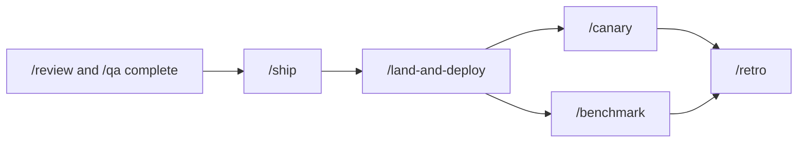

# 第十章：GStack的发布自动化与持续监控

## 引言

前一章讲的是跨代理协作与并行工作，这一章继续往工程交付的下游走：当需求、设计、实现、审查和 QA 都完成后，GStack 如何把发布和后续验证真正收口？

官方仓库对这一层的描述很完整，核心技能主要包括：

- `/ship`
- `/land-and-deploy`
- `/canary`
- `/benchmark`
- `/retro`

这些能力共同构成了 GStack 从“准备上线”到“上线后继续观察”的完整闭环。

## `/ship`：把代码推进到可交付状态

官方把 `/ship` 定义成 **Release Engineer**。

README 和 `docs/skills.md` 都强调，它处理的是最后一公里，而不是前期 brainstorming。它的职责包括：

- 与主分支同步
- 跑测试
- 审计覆盖率
- 推送代码
- 创建或更新 PR

对 GStack 来说，`/ship` 的价值不是替代所有发布系统，而是把“准备交付”这一步强行标准化。

## `/ship` 还会补齐测试基础

官方文档特别强调了一点：如果项目还没有测试框架，`/ship` 会尝试把测试能力补起来。

README 和 `docs/skills.md` 里都明确提到：

- 检测项目当前测试状态
- 必要时引导或补齐测试框架
- 给交付动作配上覆盖率审计

这也是 GStack 的一个重要特征：很多技能不只是执行任务，还会把工程流程往更完整的方向推。

## `/land-and-deploy`：从“已批准”到“生产已验证”

官方 README 对 `/land-and-deploy` 的定义非常直接：

> One command from "approved" to "verified in production."

也就是说，它关注的是：

- 合并 PR
- 等待 CI
- 触发部署
- 验证生产健康状态

如果说 `/ship` 负责把分支变成可合并状态，那么 `/land-and-deploy` 负责把“已批准”推进成“生产已验证”。

## `/canary`：发布后的持续观察

官方 `docs/skills.md` 把 `/canary` 定义成 **post-deploy monitoring mode**。

它的工作方式非常具体：

- 使用 browse daemon 定期访问关键页面
- 检查控制台错误
- 观察性能回退
- 监测页面失败和视觉异常
- 定期截图并和基线对比

它体现的是一个明确的发布后监控闭环。

## `/benchmark`：建立性能基线

官方把 `/benchmark` 定义成 **Performance Engineer**。

根据 `docs/skills.md`，它的职责是：

- 建立页面性能基线
- 记录 load time
- 记录 Core Web Vitals
- 统计资源数量和传输体积
- 在 PR 前后做对比

官方还明确说明，它使用的是 browse daemon 驱动的真实 Chromium 测量，而不是纯合成估算。

这意味着 GStack 的性能能力和浏览器体系是联动的，不是凭空生成一份数字报告。

## `/retro`：交付完成后的团队复盘

官方把 `/retro` 定义成 **Eng Manager** 模式，但它负责的是事后复盘，而不是前期规划。

根据 `docs/skills.md`，`/retro` 会分析：

- 提交历史
- 工作模式
- 交付节奏
- 测试健康度
- 个人和团队的增长机会

README 还提到 `/retro global` 可以跨多个项目和多个 AI 工具运行。

也就是说，在 GStack 的设计里，交付不是“上线就结束”，而是要把结果再折回到下一轮流程里。

## 一条贴近官方的交付闭环

这张图表达的是官方技能组合出来的最自然闭环：

- 先确认质量
- 再准备交付
- 然后完成部署
- 上线后继续监控和做性能对比
- 最后回到复盘

## 为什么这是 GStack 更真实的“长期能力”？

如果只看官方仓库，GStack 的持续性能力主要体现在这些地方：

- 发布后仍然保留验证动作
- 监控不是一次性检查，而是循环观察
- 性能基线会被持久化，供后续对比
- 复盘把本轮交付结果重新带回后续工作

这些能力共同构成了 GStack 当前真正公开和可落地的持续交付边界。

## 这一章里的关键结论

GStack 当前公开出来的“持续能力”，不是抽象自主 Agent 理论，而是一条非常工程化的交付闭环：

- `/ship` 让分支达到可交付状态
- `/land-and-deploy` 把批准推进成生产验证
- `/canary` 做发布后监控
- `/benchmark` 记录性能基线
- `/retro` 做复盘和趋势分析

这条链路，才是官方仓库里真正明确存在的长期工作机制。

---

**下一篇预告**：第十一章《现实世界应用案例》，看看这些能力如何在真实业务场景里组合起来。
