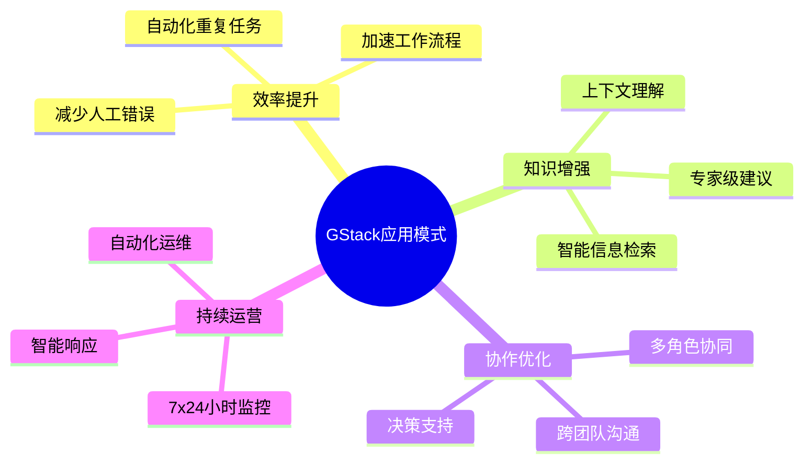
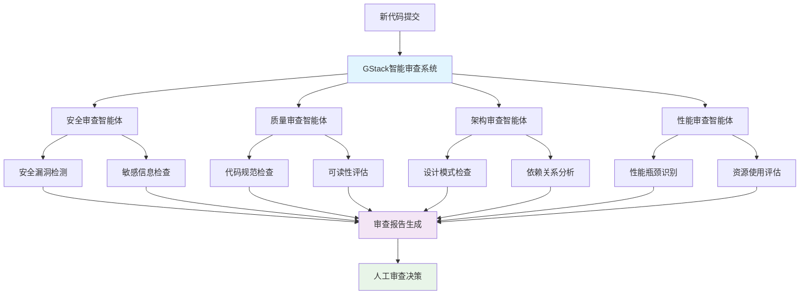
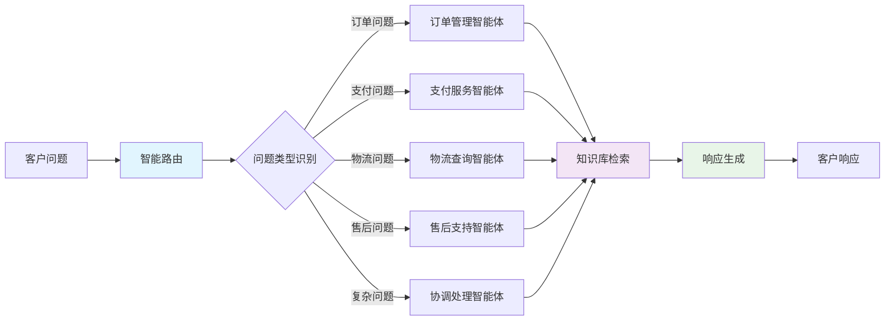
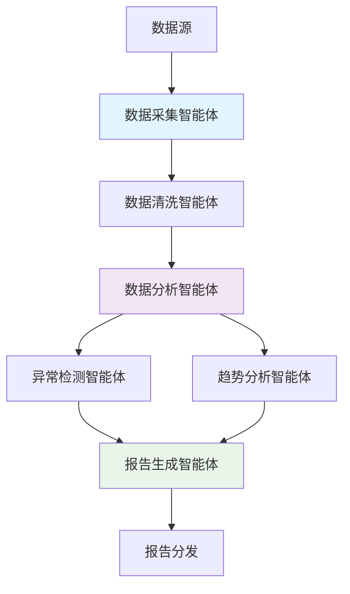

# 第十一章：现实世界应用案例

## 引言

前十章已经把 GStack 的入门方法、核心原理和高级能力铺开了。接下来最重要的问题不是“它还能做什么”，而是“这些能力在真实业务里怎么落地”。理论知识很重要，但真正理解 GStack 价值的最好方式，仍然是看它在现实中如何被使用。

本章将展示基于 GStack 官方能力整理出的典型落地场景，重点是看官方已经公开的技能和工作流，放进真实业务问题后可以怎样组合起来解决事。

## 核心概念

### GStack应用的典型模式



### 评估GStack适用性

不是所有问题都适合用GStack解决。在选择使用GStack时，考虑以下因素：

| 适用场景 | 不适用场景 |
|---------|-----------|
| 重复性任务 | 一次性任务 |
| 知识密集型工作 | 纯计算密集型工作 |
| 多步骤复杂流程 | 简单直接的逻辑 |
| 需要上下文理解 | 规则固定的操作 |
| 可以接受一定不确定性 | 需要绝对精确 |

## 实践案例一：智能代码审查系统

### 背景与挑战

某大型科技公司每日有数百次代码提交。传统代码审查面临以下挑战：

- **人力不足**：审查人员数量有限，难以覆盖所有提交
- **审查标准不一**：不同审查者关注点不同，质量参差不齐
- **响应时间长**：开发人员需要等待审查结果，影响效率
- **知识盲区**：审查者可能遗漏某些问题类型

### 解决方案

使用GStack构建智能代码审查系统，实现自动化和半自动化的代码审查。

### 系统设计



### 实施步骤

**第一步：设置自动化审查触发**

```bash
# 在CI/CD流水线中集成GStack
在每次代码提交后触发：
1. 检测变更的文件和代码
2. 调用GStack代码审查智能体
3. 收集所有审查结果
4. 生成结构化审查报告
5. 通知相关开发人员和审查者
```

**第二步：配置并行审查流程**

```bash
# 主会话执行工程审查
/review

# 高风险改动追加安全审查
/cso

# 需要第二个 AI 并行查看页面或管理后台时
/pair-agent

# 如果需要第二模型做独立复核
/codex
```

**第三步：整合审查流程**

```yaml
智能审查工作流:
  阶段1_快速检查:  # 1分钟内完成
    - /review 检查实现风险
    - /cso 检查安全问题
    - 敏感信息和明显配置错误扫描

  阶段2_深度分析:  # 5-10分钟
    - /qa 验证关键路径和失败路径
    - /codex 或配对代理做第二视角复核
    - 汇总代码质量、性能和架构一致性问题

  阶段3_人工决策:  # 按需触发
    - 复杂问题标记
    - 争议问题汇总
    - 改进建议生成
```

### 实施效果

| 指标 | 实施前 | 实施后 | 改善 |
|------|--------|--------|------|
| 审查覆盖率 | 45% | 100% | +55% |
| 平均响应时间 | 4小时 | 15分钟 | 94% |
| 安全漏洞检出率 | 60% | 95% | +35% |
| 代码审查质量 | 波动大 | 稳定提升 | 显著 |
| 开发人员满意度 | 3.2/5 | 4.6/5 | +44% |

### 关键成功因素

1. **分级审查**：快速检查+深度分析，平衡速度和质量
2. **专业分工**：不同智能体专注不同审查维度
3. **人机协作**：自动化处理明确问题，人工处理复杂情况
4. **持续学习**：从审查反馈中不断改进智能体
5. **透明可追溯**：所有审查决策都有明确依据

## 实践案例二：智能客户服务系统

### 背景与挑战

某电商平台的客户服务中心面临：

- **咨询量大**：每天上万条客户咨询
- **问题类型多**：订单、支付、物流、售后等
- **响应要求高**：客户期望快速准确响应
- **知识分散**：产品、政策、流程信息分散在各处

### 解决方案

使用GStack构建智能客服系统，实现高效、准确的客户问题处理。

### 系统架构



### 功能实现

**1. 智能问题路由**

```bash
# GStack自动识别问题类型
当收到客户咨询时：
1. 分析问题内容关键词和上下文
2. 使用AI模型识别问题类别
3. 路由到对应的处理智能体
4. 如果是多类型问题，路由到协调智能体
```

**2. 知识库智能检索**

```bash
# 使用GStack技能检索知识
客户询问："如何申请退款？"

智能体自动：
1. 在知识库中搜索相关文档
2. 理解具体退款场景和条件
3. 检索最新的退款政策
4. 生成个性化的响应说明

生成响应：
"您好！申请退款的操作步骤如下：
1. 进入订单详情页
2. 点击'申请退款'
3. 选择退款原因
4. 提交申请

注意：购买后7天内可无条件退款。"
```

**3. 跨系统信息查询**

```bash
# 集成多个系统查询
客户询问："我的订单12345什么时候能送到？"

智能体自动：
1. 查询订单系统获取订单状态
2. 查询物流系统获取配送信息
3. 根据配送方式计算预计送达时间
4. 综合信息生成响应

调用工具：
- queryOrder(orderId: "12345")
- checkShipping(trackingNumber: "xyz123")
- calculateETA(shippingMethod, distance)
```

### 实施效果

| 指标 | 实施前 | 实施后 | 改善 |
|------|--------|--------|------|
| 自动响应率 | 30% | 78% | +48% |
| 平均响应时间 | 2小时 | 30秒 | 99% |
| 问题解决率 | 55% | 88% | +33% |
| 客户满意度 | 3.1/5 | 4.5/5 | +45% |
| 客服成本 | 高 | 中低 | 35% |

## 实践案例三：智能数据分析与报告

### 背景与挑战

某数据团队需要：

- **每日分析大量数据**
- **生成多维度报告**
- **发现数据异常和趋势**
- **支持业务决策**

人工分析耗时长、易出错，难以满足时效要求。

### 解决方案

使用GStack实现自动化数据分析流程。

### 工作流设计



### 实现要点

**自动化分析流程**

```bash
# 由 CI、cron 或工作流平台每天触发一次 GStack 会话

# 1. 采集昨日业务数据
# 2. 清洗并标准化数据
# 3. 执行多维度分析
# 4. 用 /learn 搜索历史异常与既有处理经验
/learn

# 5. 生成报告并分发
```

**智能异常分析**

```bash
# 发现异常时自动分析
当检测到指标异常时：

1. 历史对比分析
   - 对比过去7天、30天同期数据
   - 识别异常是否为周期性

2. 维度下钻分析
   - 按地区、产品、渠道等维度细分
   - 找出异常的具体来源

3. 外部因素关联
   - 检查营销活动、节假日等外部事件
   - 关联外部因素与异常的因果关系

4. 生成分析结论
   "核心指标昨日下降15%，主要原因是：
    - 华东地区受天气影响订单减少
    - 某产品缺货导致销售下降
    - 建议增加库存和调整营销策略"
```

### 实施效果

| 指标 | 实施前 | 实施后 | 改善 |
|------|--------|--------|------|
| 报告生成时间 | 4小时 | 自动 | 100% |
| 异常发现及时性 | 滞后24小时 | 实时 | 显著 |
| 分析深度 | 有限 | 多维度 | 提升 |
| 数据准确性 | 90% | 99% | +9% |
| 业务响应速度 | 慢 | 快 | 显著 |

## 实践案例四：智能内容创作助手

### 背景与挑战

内容创作团队面临：

- **创意枯竭**
- **初稿耗时长**
- **风格不统一**
- **SEO优化需求**

### 解决方案

使用GStack作为智能写作助手，辅助内容创作流程。

### 应用场景

**1. 主题扩展和头脑风暴**

```bash
# GStack帮助扩展主题
主题："远程工作的挑战"

GStack生成扩展角度：
1. 远程工作对团队协作的影响
2. 远程员工的孤独感与心理健康
3. 工作生活边界的模糊化
4. 技术基础设施的依赖性
5. 企业文化在远程环境中的挑战
6. 跨时区沟通的复杂性

每个角度进一步扩展：
- 具体表现
- 案例研究
- 解决方案
- 未来趋势
```

**2. 大纲和结构建议**

```bash
# 为文章生成结构化大纲
主题："AI在医疗健康领域的应用"

GStack建议大纲结构：

引言
- AI医疗的现状
- 本文探讨范围

技术基础
- 医疗AI的核心技术
- 数据处理和分析能力

主要应用场景
1. 医学影像诊断
2. 药物研发加速
3. 个性化治疗方案
4. 健康管理助手
5. 医院运营优化

挑战与限制
- 数据隐私问题
- 算法可解释性
- 监管和伦理问题

未来展望
- 技术发展趋势
- 行业融合前景
- 政策环境演变

结论
- 关键要点总结
- 行动建议
```

**3. 内容草稿生成**

```bash
# 基于大纲生成初稿内容
章节："医学影像诊断"

GStack生成内容：

医学影像诊断是AI在医疗领域最成熟的应用之一。

工作原理：
AI系统通过深度学习算法，分析X光、CT、MRI等医学影像。
系统学习大量已标注的医学图像，建立疾病的特征识别模型。

应用场景：
1. 疾病早期筛查：在症状明显前发现异常
2. 辅助诊断：为医生提供第二意见
3. 质量控制：检查人工诊断的准确性

效果评估：
多项研究表明，AI在某些特定疾病的影像识别上，
已经达到或超越专家医生的水平。例如，在视网膜病变
检测中，AI的准确率可达97%。

实际案例：
某医院引入AI影像诊断系统后，早期肺癌检出率
提高了40%，同时减少了30%的误诊率。

[注：作者需要根据实际情况调整数据和案例]
```

**4. 内容优化建议**

```bash
# GStack分析内容并提供优化建议
分析文章草稿后提供：

结构建议：
- 建议在"效果评估"后增加"局限性"小节
- 结论部分可以更具体

内容建议：
- "工作原理"部分可以增加具体技术细节
- "实际案例"建议增加更多数据支撑

风格建议：
- 整体语言风格统一，保持专业性
- 避免过于技术化的术语，增加可读性

SEO建议：
- 建议标题包含"医疗AI"关键词
- 建议在文中自然提及"AI诊断"、"医疗影像"
- 建议增加相关内部链接
```

### 实施效果

| 指标 | 实施前 | 实施后 | 改善 |
|------|--------|--------|------|
| 初稿生成时间 | 8小时 | 2小时 | 75% |
| 内容创意数量 | 有限 | 丰富 | 显著 |
| 结构一致性 | 波动 | 稳定 | 提升 |
| SEO效果 | 中 | 良好 | 提升 |
| 创作者满意度 | 3.5/5 | 4.7/5 | +34% |

## 实践案例五：智能测试与质量保证

### 背景与挑战

软件测试团队面临：

- **测试用例维护困难**
- **回归测试耗时长**
- **测试覆盖率难以保证**
- **缺陷报告质量参差不齐**

### 解决方案

使用GStack辅助测试流程，提高测试效率和质量。

### 应用场景

**1. 自动化测试用例生成**

```bash
# GStack分析代码自动生成测试用例
分析新提交的代码文件：

function processPayment(paymentData) {
  if (!paymentData.amount) throw new Error("金额不能为空")
  if (!paymentData.currency) throw new Error("货币类型不能为空")
  if (paymentData.amount <= 0) throw new Error("金额必须大于0")

  // 处理逻辑...
}

GStack自动生成测试用例：

// 测试用例1：正常支付
测试正常支付流程：
输入: { amount: 100, currency: "USD" }
预期: 成功处理

// 测试用例2：金额为空
测试金额缺失：
输入: { currency: "USD" }
预期: 抛出"金额不能为空"错误

// 测试用例3：金额为0或负数
测试无效金额：
输入1: { amount: 0, currency: "USD" }
输入2: { amount: -10, currency: "USD" }
预期: 抛出"金额必须大于0"错误

// 测试用例4：边界值
测试边界情况：
输入1: { amount: 0.01, currency: "USD" }
输入2: { amount: 9999999.99, currency: "USD" }
预期: 正确处理边界值
```

**2. 测试结果智能分析**

```bash
# GStack分析测试结果，识别问题模式
分析失败的测试用例：

模式识别：
1. 认证相关测试全部失败
   - 可能原因：认证服务变更或Token过期
   - 建议：检查认证配置

2. 偶发性失败测试（有时成功有时失败）
   - 可能原因：竞态条件或时序问题
   - 建议：增加等待时间或使用同步机制

3. 某些API测试响应超时
   - 可能原因：服务性能下降或网络问题
   - 建议：检查服务健康状态

生成分析报告：
"本次测试运行共200个用例，失败12个。
发现主要问题：
1. 认证模块：6个失败，可能是配置变更导致
2. 性能问题：4个超时，建议检查资源使用
3. 边界条件：2个失败，建议补充边界测试"
```

**3. 缺陷报告智能分析**

```bash
# GStack辅助分析缺陷报告
收到新的缺陷报告后：

缺陷内容："页面加载很慢"

GStack智能补充信息：
1. 建议补充：
   - 具体页面URL
   - 加载时间（秒）
   - 环境信息（浏览器、网络）
   - 复现步骤

2. 可能原因分析：
   - 资源文件过大
   - 网络请求过多
   - 代码执行效率低
   - 服务器响应慢

3. 修复建议：
   - 使用浏览器开发工具分析性能
   - 检查网络瀑布图
   - 考虑资源优化（压缩、缓存）

4. 优先级建议：
   - 高优先级：如果影响核心业务流程
   - 中优先级：如果影响用户体验但不阻塞
   - 低优先级：如果是优化性问题
```

### 实施效果

| 指标 | 实施前 | 实施后 | 改善 |
|------|--------|--------|------|
| 测试用例编写效率 | 低 | 高 | 提升200% |
| 缺陷分析时间 | 30分钟 | 5分钟 | 83% |
| 测试覆盖率 | 65% | 85% | +20% |
| 缺陷修复周期 | 长 | 短 | 缩短40% |
| 测试质量 | 中高 | 高 | 提升 |

## 跨领域应用模式总结

### 共同成功要素

通过以上案例，可以总结出GStack成功应用的共同要素：

```yaml
GStack应用成功要素:
  清晰目标:
    - 明确要解决的具体问题
    - 定义成功的衡量标准
    - 理解业务价值和约束

  合理范围:
    - 从小规模、低风险场景开始
    - 逐步扩展应用范围
    - 保持人类监督和控制

  充分准备:
    - 准备必要的数据和资源
    - 建立清晰的工作流程
    - 配置适当的权限和安全措施

  持续优化:
    - 监控应用效果
    - 收集用户反馈
    - 迭代改进智能体行为

  知识积累:
    - 记录成功经验和失败教训
    - 建立最佳实践文档
    - 分享给团队和社区
```

### 不同行业的特点

| 行业 | 主要挑战 | GStack应用重点 | 典型价值 |
|------|---------|---------------|---------|
| **软件开发** | 复杂度高，协作密集 | 代码分析、自动化流程 | 效率提升，质量保证 |
| **客户服务** | 问题多样，响应要求高 | 智能路由、知识检索 | 响应加速，满意度提升 |
| **数据分析** | 数据量大，时效性强 |一般自动化分析、异常检测 | 实时洞察，决策支持 |
| **内容创作** | 创意需求，风格多样 | 内容生成、优化建议 | 创作加速，质量稳定 |
| **测试质量** | 用例复杂，覆盖要求高 | 用例生成、结果分析 | 测试效率，质量提升 |

## 常见问题解答

### Q1: 如何开始我的第一个GStack应用？

**A:** 建议按照以下步骤：

1. **识别机会**
   - 找到重复性、耗时的工作
   - 评估是否适合AI增强
   - 估算潜在价值

2. **小规模试点**
   - 选择低风险场景
   - 从简单任务开始
   - 快速验证效果

3. **逐步扩展**
   - 基于试点经验改进
   - 扩大到更多场景
   - 持续优化效果

4. **规模化应用**
   - 标准化工作流程
   - 建立监控机制
   - 培训团队成员

### Q2: GStack应用如何衡量ROI？

**A:** 从多个维度衡量：

```yaml
ROI衡量维度:
  直接效益:
    - 节省的人力时间
    - 减少的错误成本
    - 提高的效率产出

  间接效益:
    - 响应速度提升
    - 客户满意度改善
    - 团队协作增强

  长期效益:
    - 知识积累和组织学习
    - 能力扩展和创新空间
    - 竞争优势建立

  成本考量:
    - 初始设置和学习成本
    - 持续维护和优化成本
    - 风险和容错成本
```

### Q3: GStack应用如何与现有系统集成？

**A:** GStack提供了多种集成方式：

```yaml
集成方式:
  API集成:
    - 通过工具调用外部API
    - 处理API响应和错误
    - 管理API认证和限流

  文件系统:
    - 读写本地和远程文件
    - 处理各种文件格式
    - 文件操作权限控制

  数据库:
    - 查询和更新数据库
    - 事务和错误处理
    - 连接池和性能优化

  消息队列:
    - 发送和接收消息
    - 异步处理和重试
    - 消息格式和协议

  Webhook:
    - 接收外部事件通知
    - 触发处理流程
    - 回调和状态同步
```

## 总结

GStack在现实世界中的应用已经证明了其价值。从代码审查到客户服务，从数据分析到内容创作，GStack正在各个领域帮助企业提高效率、降低成本、提升质量。

### 关键收获

1. **场景化应用**：不同场景需要不同的GStack配置和策略
2. **人机协作**：最好的结果是智能体辅助人工，而非完全替代
3. **持续优化**：应用效果会随着使用和调优而不断提升
4. **价值导向**：始终关注实际业务价值，而非技术本身
5. **知识积累**：每个应用都是学习和积累知识的机会

### GStack应用特色

1. **灵活适应**：可以根据具体场景灵活调整
2. **快速迭代**：能够快速尝试和验证新想法
3. **易于集成**：与现有系统和工具无缝集成
4. **可观测性**：提供清晰的执行过程和结果
5. **持续学习**：可以从使用中不断改进

### 未来展望

GStack的应用前景广阔：
- **更多行业渗透**：从IT行业扩展到更多传统行业
- **更深业务整合**：从辅助工具变为核心能力
- **更智能的协作**：多个GStack应用之间的智能协作
- **更低的使用门槛**：让更多人能够使用AI能力
- **更丰富的生态**：更多技能和最佳实践

### 行动建议

1. **开始应用**：从你的工作中找到适合GStack的场景
2. **小步快跑**：从小规模试点开始，快速验证价值
3. **分享经验**：记录和分享你的应用经验
4. **参与社区**：加入GStack社区，学习和贡献
5. **持续探索**：关注新技术和新用法，持续改进

GStack不是科幻未来，而是当下可用的生产力工具。现在就开始在您的工作中应用GStack，体验AI智能体带来的效率提升和能力扩展。

---

**下一篇预告**：[未来发展趋势] - 我们将探讨GStack和AI Agent技术的发展方向，展望未来的可能性。
