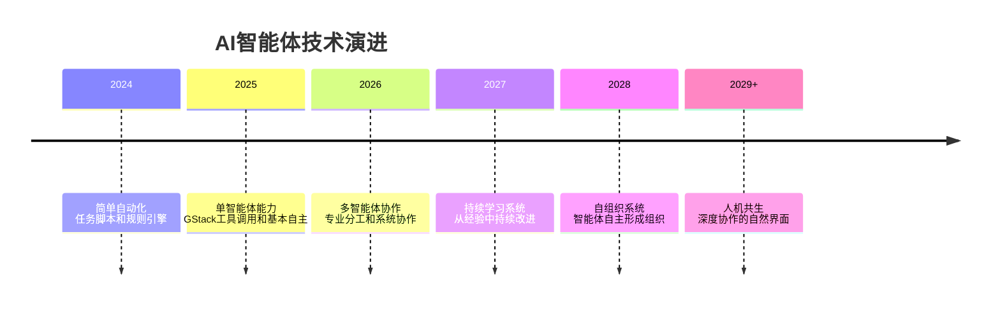
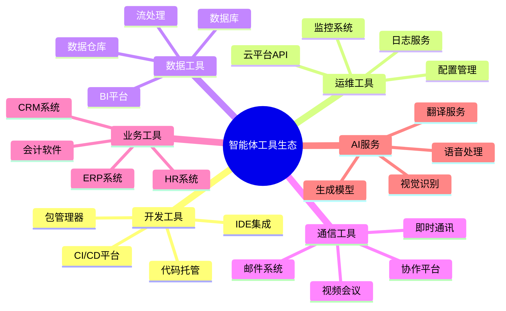
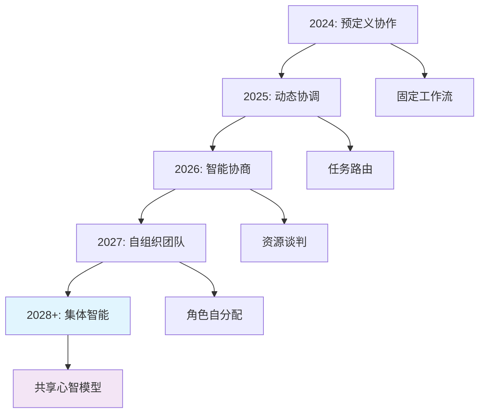
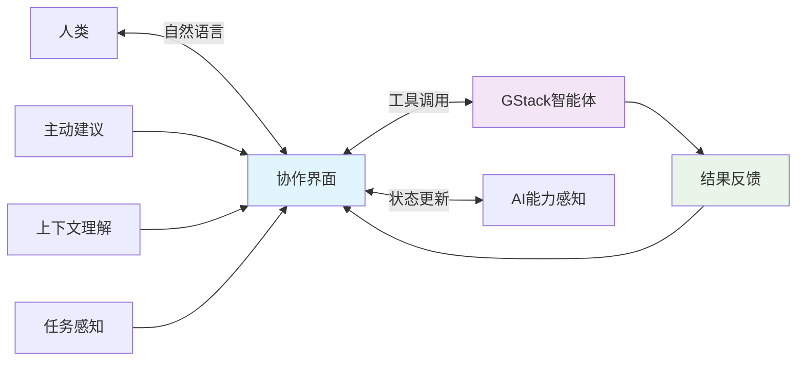
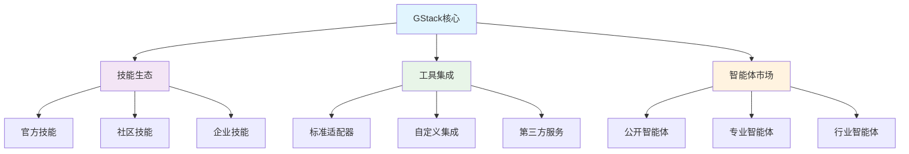

# 第十二章：未来发展趋势

## 引言

经过前 11 章，从入门、实践、原理到案例，我们已经把 GStack 的现状和能力边界大体看清。最后这一章把视线拉远，看看 AI 智能体和 GStack 可能会走向哪里。

本章将展望GStack和AI Agent技术的未来发展方向。这些趋势不仅影响技术本身，更将深刻改变我们与AI协作的方式、组织的工作模式，以及整个行业的生态格局。

## 核心概念

### 技术演进路径



### 发展驱动因素

| 因素 | 当前状态 | 未来趋势 | 影响 |
|------|---------|---------|------|
| **模型能力** | 强大的基础模型 | 更强、更快、更便宜 | 智能体能力大幅提升 |
| **工具生态** | 基础工具集成 | 丰富、深度的工具网络 | 智能体可访问更多能力 |
| **用户期望** | 新技术尝试 | 常态化使用 | 智能体成为日常工具 |
| **成本降低** | 早期采用者成本 | 大规模使用经济可行 | 普及率提升 |
| **监管环境** | 早期规范框架 | 成熟的治理体系 | 负责任发展 |

## 发展趋势一：更强的自主性

### 趋势描述

未来的AI智能体将具备更强的自主决策能力，能够在更少的人工干预下完成复杂任务。

### 能力演进

```yaml
自主能力演进:
  当前_L1_任务执行:
    能力: 执行明确的、步骤化的任务
    示例: "运行测试并报告结果"
    限制: 需要详细的目标和步骤

  近期_L2_目标导向:
    能力: 给定目标，自主规划执行路径
    示例: "确保测试覆盖率≥80%"
    特点: 需要明确的成功标准

  中期_L3_问题解决:
    能力: 理解问题，探索多种解决方案
    示例: "系统性能下降，找出原因并修复"
    特点: 需要定义问题边界

  远期_L4_持续优化:
    能力: 持续监控并主动改进
    示例: 发现性能下降，自动调优并监控效果
    特点: 长期目标，自主适应
```

### GStack的实现方向

```yaml
未来自主能力配置示例:
  autonomy_level: L3  # 目标导向 + 问题解决

  decision_boundaries:
    budget: 100
    risk_level: medium
    approval_threshold: high_impact

  autonomous_capabilities:
    - task_planning
    - resource_allocation
    - conflict_resolution
    - performance_optimization
```

## 发展趋势二：更深度的工具集成

### 趋势描述

智能体将能够访问和操作更广泛的工具和服务，形成真正的"数字劳动力"。

### 工具生态扩展



### 深度集成示例

```yaml
未来智能体深度工作流:
  name: 端到端客户问题处理

  integrations:
    - ticket_system: Zendesk
    - crm: Salesforce
    - code_repo: GitHub
    - build_system: Jenkins
    - monitoring: Datadog

  steps:
    - 从 CRM 获取客户信息和历史
    - 从监控系统收集相关数据
    - 分析代码仓库中的相关变更
    - 如需修复，自动创建 GitHub PR
    - 触发 CI/CD 构建和部署
    - 在工单系统中更新状态
    - 通知相关团队
```

## 发展趋势三：智能体间自然协作

### 趋势描述

多个智能体将能够像人类团队一样自然协作，形成高效的组织。

### 协作模式演进

```yaml
智能体协作演进:
  当前_L1_预定义工作流:
    特点: 固定的工作流和角色
    示例: 主从式、流水线式
    限制: 不够灵活

  近期_L2_动态协作:
    特点: 根据任务动态组织
    示例: 合同网、任务市场
    特点: 更灵活的资源配置

  中期_L3_自组织:
    特点: 智能体自主形成团队
    示例: 任务分解和自动分配
    特点: 出现新的协作模式

  远期_L4_集体智能:
    特点: 智能体形成"组织记忆"
    示例: 共享经验、集体学习
    特点: 整体能力>部分之和
```

### GStack协作路线图



## 发展趋势四：持续学习与适应

### 趋势描述

智能体将从每次执行中学习，持续改进自身行为和策略。

### 学习层次

| 学习类型 | 时间尺度 | 学习内容 | 应用方式 |
|---------|---------|---------|---------|
| **会话学习** | 单次会话 | 本次任务的上下文 | 即时应用 |
| **短期学习** | 数小时/数天 | 近期模式 | 调整策略 |
| **中期学习** | 数周 | 工作流优化 | 改进流程 |
| **长期学习** | 数月 | 能力提升 | 模型更新 |

### 学习机制实现

```yaml
持续学习配置示例:
  mode: continuous

  learning_config:
    feedback_collection: true
    performance_tracking: true
    pattern_detection: true
    strategy_optimization: true

  knowledge_management:
    persistence: true
    sharing: team
    versioning: true

  adaptation:
    automatic_tuning: true
    threshold_learning: true
    preference_learning: true
```

## 发展趋势五：人机协作新范式

### 趋势描述

AI将不再是简单的工具，而是协作伙伴。新的交互范式将使人机协作更自然、更高效。

### 协作范式演进

```yaml
人机协作范式演进:
  当前_L1_命令执行:
    模式: 人类命令，AI执行
    关系: 主从关系
    示例: "/help 检查我的代码"

  近期_L2_任务委派:
    模式: 人类定义目标，AI规划执行
    关系: 委派关系
    示例: "帮我部署这个项目"

  中期_L3_协作求解:
    模式: 人类和AI共同解决问题
    关系: 平等协作
    示例: 一起设计系统架构

  远期_L4_共生伙伴:
    模式: AI作为持续可用的能力伙伴
    关系: 伙伴关系
    示例: AI主动提供建议
```

### 自然协作界面



## 发展趋势六：生态与标准化

### 趋势描述

行业将形成标准化的智能体协议和开放的生态系统，促进互操作性和创新。

### 标准化方向

```yaml
智能体标准化领域:
  通信协议:
    - 消息格式标准
    - 服务发现机制
    - 安全通信协议

  能力描述:
    - 技能描述语言
    - 服务接口规范
    - 依赖声明格式

  互操作性:
    - 跨平台兼容
    - 数据格式标准
    - 工作流描述规范

  安全与治理:
    - 访问控制标准
    - 审计日志格式
    - 伦理准则框架
```

### GStack生态愿景



## 发展趋势七：负责任的AI

### 趋势描述

随着AI能力增强，责任、伦理和治理将成为核心关注点。

### 负责任实践框架

```yaml
负责任的AI框架:
  透明度:
    - 决策过程可解释
    - 数据使用可追溯
    - 影响评估可理解

  可控性:
    - 人工监督机制
    - 紧急停止能力
    - 审计和日志

  公平性:
    - 偏见检测和缓解
    - 包容性设计
    - 差距分析

  安全性:
    - 安全漏洞检测
    - 攻击防护机制
    - 数据隐私保护

  问责制:
    - 明确的责任边界
    - 错误补偿机制
    - 持续监督和改进
```

### GStack责任实践

```yaml
责任治理配置示例:
  audit:
    enabled: true
    log_level: detailed
    retention_days: 365

  human_oversight:
    high_risk_actions: true
    pattern_review: true
    feedback_required: true

  impact_assessment:
    before_action: true
    after_action: true
    learning: true  # 从影响中学习

  # 伦理准则
  ethics:
    fairness_check: true,  # 公平性检查
    privacy_respect: true,  # 隐私保护
    transparency: true  # 透明度保证
```

## 发展趋势八：新兴应用场景

### 趋势描述

智能体将渗透到更多行业和应用场景。

### 新兴应用领域

| 领域 | 当前应用 | 未来潜力 | 关键价值 |
|------|---------|---------|---------|
| **医疗健康** | 辅助诊断、医学影像 | 个性化治疗、药物研发 | 提升诊疗效率和质量 |
| **金融服务** | 风险评估、欺诈检测 | 自动投资建议、合规审查 | 降低风险，提高效率 |
| **教育** | 个性化学习、智能辅导 | 全程学习陪伴、能力评估 | 因材施教，规模化教育 |
| **制造** | 预测性维护、质量控制 | 自主生产线、供应链优化 | 提高效率，降低成本 |
| **法律** | 文档审查、案例检索 | 法律研究、合同分析 | 提高法律服务质量 |
| **创意** | 内容生成、设计辅助 | 创意探索、协作创作 | 扩展人类创造力 |

## 常见问题解答

### Q1: 这些趋势多久会实现？

**A:** 这是一个渐进过程，不是已经到来的明天：

```yaml
实现时间线:
  短期_1-2年:
    - 更强的工具集成
    - 改进的协作能力
    - 基础学习机制

  中期_2-4年:
    - 显著的自主性提升
    - 深度生态系统
    - 标准化协议

  长期_4-8年:
    - 高度自组织系统
    - 人机共生范式
    - 负责任的AI框架
```

### Q2: 应该如何准备迎接这些趋势？

**A:** 建议从现在开始准备：

1. **开始使用**
   - 在当前工作中应用GStack
   - 积累使用经验
   - 理解智能体能力边界

2. **学习AI原理**
   - 了解AI如何工作
   - 理解能力和局限
   - 建立合理期望

3. **关注伦理**
   - 思考AI应用的影响
   - 建立自己的伦理标准
   - 参与行业讨论

4. **投资技能**
   - 学习设计和运维AI系统
   - 理解数据治理
   - 掌握AI时代的软技能

5. **保持开放**
   - 持续学习新技术
   - 实验新用例
   - 分享经验和见解

### Q3: AI智能体会取代人类工作吗？

**A:** 更可能的是增强和改变工作：

```yaml
工作演变模式:
  会被取代:
    - 高度重复的简单任务
    - 可完全规则化的操作
    - 纯数据录入和处理

  会被增强:
    - 需要判断和推理的任务
    - 需要创造力的工作
    - 需要人际沟通的活动

  会新出现:
    - AI系统设计和运维
    - 人机协作协调
    - AI应用的伦理审查

  会更重视:
    - 战略思维和决策
    - 复杂问题解决
    - 创新和愿景
```

关键在于**适应和进化**，而非对抗或恐惧。

## 总结

AI智能体技术正在快速发展，GStack正处于这一变革的前沿。从更强的自主性到更深度的集成，从自然的人机协作到负责任的AI，这些未来趋势将深刻改变我们的工作方式。

### 关键趋势回顾

1. **自主性增强**：智能体能在更少监督下完成更复杂任务
2. **深度集成**：与更广泛的工具和服务深度整合
3. **自然协作**：多智能体像团队一样协同工作
4. **持续学习**：从经验中不断改进和能力提升
5. **新协作范式**：人与AI建立更自然的伙伴关系
6. **生态标准化**：形成开放标准和互操作的生态系统
7. **负责任AI**：透明、可控、公平、安全的AI实践
8. **场景扩展**：渗透到更多行业和应用领域

### 给读者的建议

1. **保持学习**：AI技术快速演进，持续学习至关重要
2. **积极实验**：在可控环境中尝试新功能和用例
3. **参与社区**：加入GStack和更广泛的AI社区
4. **伦理思考**：在应用AI时考虑其社会影响
5. **长期视角**：关注长期趋势，而非短期炒作

### GStack的定位

GStack正在：
- **引领实践**：让AI智能体从理论走向实用
- **降低门槛**：让更多开发者能够使用AI能力
- **建立生态**：培育技能和工具的开放生态系统
- **推动标准**：参与建立行业最佳实践和标准

### 最后的思考

未来不是遥不可及的幻想，而是正在发生的现实。通过GStack，开发者已经在参与塑造这个未来。

智能体不是要取代人类的工具，而是要扩展人类能力、放大人类影响、释放人类创造力的伙伴。最重要的是：**开始使用，持续学习，积极参与**。

未来的工作方式正在形成，而GStack是通往这个未来的一座桥梁。这座桥梁不仅连接现在和未来，更连接可能性与现实。

---

**系列完结**

感谢阅读GStack系列文章。希望这些内容能够帮助你理解、使用和创新AI智能体技术。未来已来，让我们一起参与创造。

---
---
**系列目录**：
- [第一章：GStack简介与核心概念](./2026-04-18-第01章-第一章GStack简介与核心概念.md) 👉 下一章
- [第二章：环境搭建与基础配置](./2026-04-18-第02章-第二章环境搭建与基础配置.md) 👉 下一章
- [第三章：GStack能做什么](./2026-04-18-第03章-第三章GStack能做什么.md) 👉 下一章
- [第四章：核心技能与工作流](./2026-04-18-第04章-第四章核心技能与工作流.md) 👉 下一章
- [第五章：GStack如何把AI组织成虚拟团队](./2026-04-18-第05章-第五章GStack如何把AI组织成虚拟团队.md) 👉 下一章
- [第六章：GStack架构与实现机制](./2026-04-18-第06章-第六章GStack架构与实现机制.md) 👉 下一章
- [第七章：GStack如何连接浏览器与外部能力](./2026-04-18-第07章-第七章GStack如何连接浏览器与外部能力.md) 👉 下一章
- [第八章：GStack的learnings与跨会话经验](./2026-04-18-第08章-第八章GStack的learnings与跨会话经验.md) 👉 下一章
- [第九章：GStack的跨代理协作与并行工作](./2026-04-18-第09章-第九章GStack的跨代理协作与并行工作.md) 👉 下一章
- [第十章：GStack的发布自动化与持续监控](./2026-04-18-第10章-第十章GStack的发布自动化与持续监控.md) 👉 下一章
- [第十一章：现实世界应用案例](./2026-04-18-第11章-第十一章现实世界应用案例.md) 👉 下一章
- [第十二章：未来发展趋势](./2026-04-18-第12章-第十二章未来发展趋势.md) 👈 当前位置

