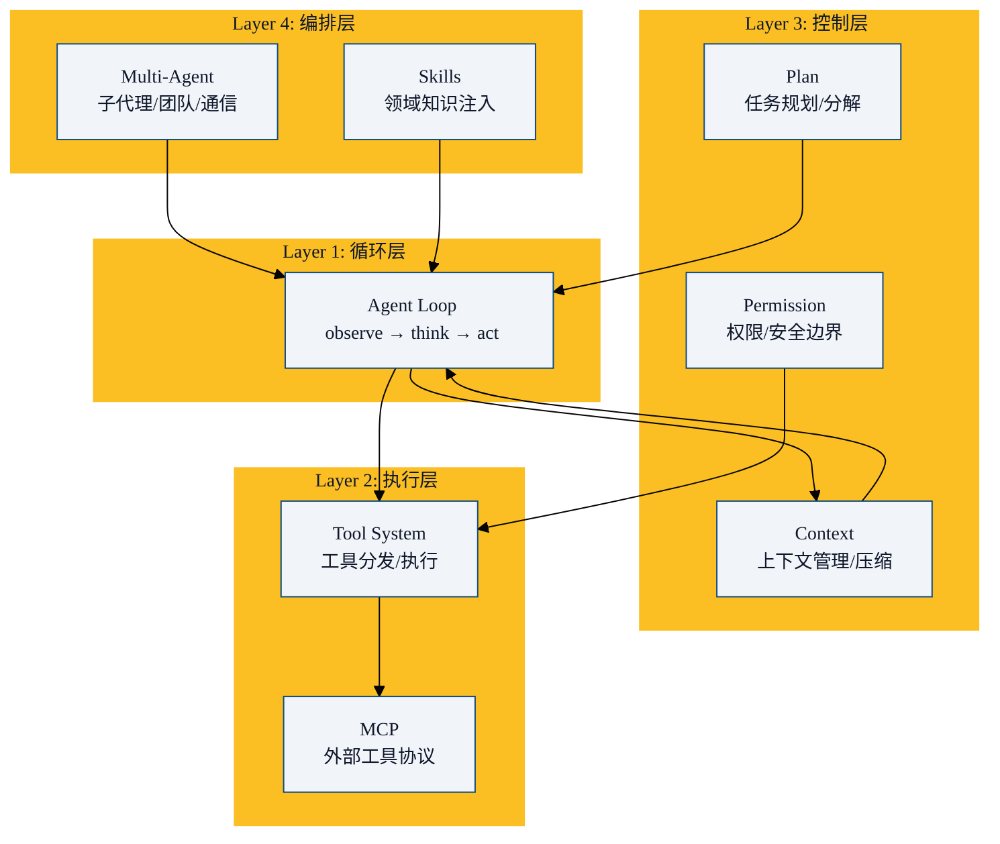
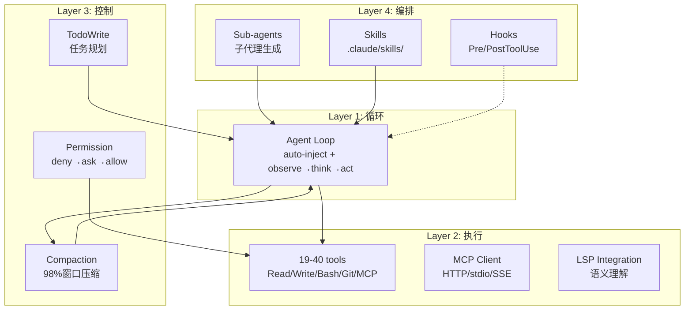

上一章我们定义了 Harness。这一章我们把它拆开，看看里面有什么。

## 总览：四层模型

任何一个完整的 Harness，都由四个层次组成：



每一层逐级递进。没有任何一层可以省略，但可以按需增强。

## 第一层：Agent Loop（循环层）

Harness 的**心跳**。没有循环，Agent 就是一问一答的 chatbot。

```
┌─────────────────────────────────────────┐
│              Agent Loop                  │
│                                          │
│  Observe ──→ Think ──→ Act              │
│     ↑                   │               │
│     └───────←───────────┘               │
│          (结果反馈)                       │
└─────────────────────────────────────────┘
```

核心代码（最小实现）：

```python
def agent_loop(task: str, tools: dict, max_turns: int = 50):
    messages = [{"role": "user", "content": task}]
    context = load_context()  # CLAUDE.md, MEMORY.md, git status...

    for turn in range(max_turns):
        # 1. Observe: 组装当前状态
        full_context = assemble_context(messages, context)

        # 2. Think: 模型推理 + 选择行动
        response = model.chat(full_context, tools)

        if response.is_text_only():
            # 模型认为任务完成
            return response.text

        # 3. Act: 执行工具调用
        for tool_call in response.tool_calls:
            result = execute_tool(tool_call, permission_check)
            messages.append(format_result(result))

        # 4. 检查上下文是否需要压缩
        if context_near_limit():
            messages = compact(messages)
```

关键设计决策：

| 决策 | 选项 | 影响 |
|------|------|------|
| 循环上限 | 50/100/无限制 | 防止死循环 vs 复杂任务需要多轮 |
| 退出条件 | 纯文本/显式 done/用户中断 | 太早退出 vs 过度执行 |
| 并行工具 | 支持/不支持 | 速度 vs 实现复杂度 |
| 流式响应 | 开/关 | 用户体验 vs 实现复杂度 |

## 第二层：Tool System（执行层）

工具系统是 Harness 的**双手**。它定义了什么操作可用、怎么执行、怎么反馈。

### 工具类型

每个编码 Harness 都至少包含这些工具：

| 类别 | 工具 | 用途 |
|------|------|------|
| **文件读取** | Read, Grep, Glob | 理解代码库 |
| **文件写入** | Write, Edit | 修改代码 |
| **命令执行** | Bash/Shell | 构建、测试、部署 |
| **版本控制** | Git | 分支、提交、diff |
| **网络** | WebFetch, WebSearch | 获取外部信息 |
| **扩展** | MCP tools | 数据库、API、浏览器... |

### 工具定义

每个工具都需要明确的 schema：

```json
{
  "name": "read_file",
  "description": "Read a file from the local filesystem",
  "parameters": {
    "type": "object",
    "required": ["file_path"],
    "properties": {
      "file_path": {
        "type": "string",
        "description": "Absolute path to the file"
      },
      "offset": {
        "type": "integer",
        "description": "Line number to start reading from"
      }
    }
  }
}
```

### 工具分发

```
模型输出 tool_call → Harness 匹配工具 → 权限检查 → 执行 → 格式化结果 → 返回模型
```

关键原则：
- **显式 schema > 自然语言描述**：模型更擅长理解结构化 schema
- **执行结果精炼**：不要返回整个文件，返回摘要 + 关键行
- **错误友好**：工具失败时返回清晰的错误信息，帮助模型修正

## 第三层：Control Layer（控制层）

### 3a. Permission System（权限）

Harness 的**免疫系统**。常见设计：deny → ask → allow 三级管道。

```
每个 Tool Call
    │
    ▼
┌─────────┐
│ DENY?   │──Yes──▶ BLOCK （如读取 .env）
└─────────┘
    │ No
    ▼
┌─────────┐
│ ASK?    │──Yes──▶ 询问用户确认
└─────────┘
    │ No/Accepted
    ▼
┌─────────┐
│ ALLOW   │──▶ 执行
└─────────┘
```

规则配置示例：

```yaml
permissions:
  # 自动允许（只读操作）
  - pattern: "read_file|grep|glob|ls|git_status|git_diff|git_log"
    action: allow

  # 需确认（修改操作）
  - pattern: "write_file|edit|bash.*"
    action: ask

  # 永远拒绝
  - pattern: "*.env|*.key|*.pem|rm -rf|sudo|git push --force"
    action: deny
```

### 3b. Context Management（上下文）

Harness 的**记忆管理**。核心挑战：LLM 的上下文窗口有限（当前 ~200K tokens），而一次复杂任务可能跨越数百轮对话。

策略：

```
Auto-Inject（每轮注入）:
├── CLAUDE.md / 项目规则
├── Git status（增量快照）
└── 最近的对话历史

Compaction（上下文快满时）:
├── 保留关键决策和工具结果
├── 压缩中间推理
└── 移除已完成步骤的细节

Lazy Loading:
├── MCP 服务器只加载工具名
├── Skills 按需加载
└── 大文件只加载索引
```

### 3c. Planning（规划）

让 Agent 有**目标和进度意识**。

```
用户目标: "为这个项目添加 OAuth 登录"

Agent Plan:
├── 1. 探索现有认证代码        [done]
├── 2. 安装 OAuth 依赖          [done]
├── 3. 实现 OAuth 回调端点       [in_progress]
├── 4. 添加前端登录按钮          [pending]
├── 5. 写测试                   [pending]
└── 6. 更新文档                  [pending]
```

TodoWrite 系统就是这个规划层的具象化——Agent 产生计划 → 用户可见 → 可指导调整 → Agent 按计划执行。

## 第四层：Orchestration Layer（编排层）

### 4a. Multi-Agent

子代理系统——当任务太大，让多个"专家"分工：

```
主 Agent（Orchestrator）
    │
    ├──→ 子 Agent 1: "研究 OAuth 2.0 最佳实践"（搜索+总结）
    ├──→ 子 Agent 2: "实现后端认证逻辑"（写代码+写测试）
    └──→ 子 Agent 3: "更新前端登录页面"（React 组件）
```

关键机制：
- **隔离**：每个子 Agent 有独立的上下文
- **通信**：结果回传给主 Agent
- **资源限制**：深度限制防止无限嵌套

### 4b. Skills System

按需注入领域知识。不是把所有知识都塞进 system prompt，而是：

```
当且仅当 Agent 说 "我需要处理 PDF" → 加载 PDF 处理 Skill
当且仅当 Agent 说 "我需要查询 PostgreSQL" → 加载 PostgreSQL Skill
```

这大幅节省了上下文空间，同时保持了 Agent 的能力广度。

## 完整架构：以 Claude Code 为例

让我们把这四层映射到 Claude Code 的实际架构上：



注意 LSP（Language Server Protocol）集成——这是 Claude Code 独有的优势：通过语言服务器精确理解代码语义（"这个函数在哪定义的？"），比纯文本 grep 高效得多。

## 本章小结

- Harness 由四层组成：循环层 → 执行层 → 控制层 → 编排层
- **循环层**是心跳：observe → think → act 的主循环
- **执行层**是双手：工具定义、分发、执行、结果格式化
- **控制层**是大脑皮层：权限（安全）、上下文（记忆）、规划（目标追踪）
- **编排层**是社会能力：多 Agent 协作、技能注入
- 每一层可以独立增强，但缺一不可
- 下一章：Harness vs Agent vs Model —— 三者到底什么关系？

---

**系列目录**：
- [第一章：从符号AI到深度学习 —— Agent的70年简史](../01-history/01-agent-70-years-history.md)
- [第二章：LLM时代的Agent革命 —— 2023-2026爆发期](../01-history/02-llm-era-agent-revolution.md)
- [第三章：Harness概念溯源 —— "模型是大脑，Harness是身体"](./03-harness-concept-origin.md)
- 第四章：Harness的核心架构 —— 四层模型详解 👈 当前位置
- [第五章：Harness vs Agent vs Model —— 三者关系辨析](./05-harness-agent-model-relationship.md) 👉 下一章

