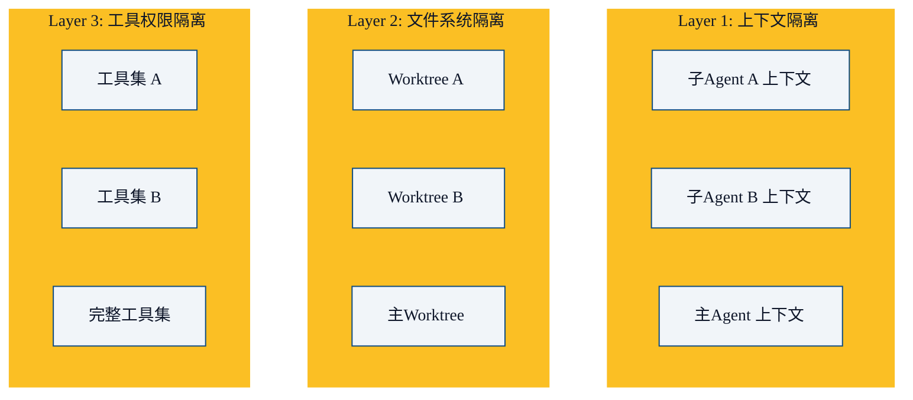

多 Agent 系统的核心挑战不是"怎么生成多个 Agent"，而是**怎么让它们不互相干扰**。这一章深入子代理的隔离设计。

## 隔离的三个层次



## Layer 1：上下文隔离

### 为什么上下文必须隔离

```
如果共享上下文:
  子Agent A 的 50 轮对话 + 子Agent B 的 50 轮对话 + 主Agent 的对话
  = 300K tokens → 爆窗口

如果独立上下文:
  主Agent: 只看到自己的对话 + 子Agent 的最终结果
  子Agent A: 只看到自己的对话（50轮，~75K tokens）
  子Agent B: 只看到自己的对话（50轮，~75K tokens）
  总和: 3 个独立窗口，互不干扰
```

### 实现

```python
async def spawn_subagent(role: str, task: str) -> str:
    # 创建独立的上下文
    sub_context = Context(
        system_prompt=f"你是 {role}，专注完成以下任务。完成后返回结果。",
        messages=[{"role": "user", "content": task}],
        max_turns=30,  # 限制轮次
    )

    # 在独立上下文中运行
    sub_agent = Agent(context=sub_context, tools=get_tools_for(role))
    result = await sub_agent.run()

    # 只返回最终结果给主 Agent
    return result.summary  # 不是完整对话历史
```

## Layer 2：文件系统隔离（Git Worktree）

当多个 Agent 需要同时修改代码时，文件系统的隔离变得重要：

```bash
# 主 Agent 在 main 分支
git worktree add /tmp/agent-a-worktree feature/auth
git worktree add /tmp/agent-b-worktree feature/api

# 子 Agent A 在 feature/auth 中工作
# 子 Agent B 在 feature/api 中工作
# 互不干扰
```

```python
async def spawn_with_worktree(role: str, task: str) -> str:
    # 创建隔离的 worktree
    worktree = await git.worktree.add(
        f"/tmp/agent-{role}-{uuid4()}",
        branch=f"feature/{role}-{uuid4()[:8]}"
    )

    # Agent 在 worktree 中工作
    sub_agent = Agent(
        context=isolated_context,
        cwd=worktree.path,  # 工作目录指向 worktree
        tools=get_safe_tools(),
    )

    result = await sub_agent.run()

    # 回收 worktree
    await git.worktree.remove(worktree.path)
    return result
```

Claude Code 的 worktree 模式和 learn-claude-code 的 s12 课程都实现了这种隔离。

### 为什么用 Worktree 而不是简单复制文件？

```
复制文件:
  - 慢（大项目可能几 GB）
  - 磁盘浪费
  - 很难合并回去

Git Worktree:
  - 即时创建（共享 .git 目录）
  - 几乎不占额外磁盘空间
  - 原生支持合并回主分支
```

## Layer 3：工具权限隔离

不同的子 Agent 需要不同的工具集：

```python
ROLE_TOOLS = {
    "researcher": ["Read", "Grep", "Glob", "WebSearch", "WebFetch"],
    "coder": ["Read", "Write", "Edit", "Grep", "Glob", "Bash"],
    "reviewer": ["Read", "Grep", "Glob", "Bash", "Git"],
    "tester": ["Read", "Write", "Edit", "Bash"],
}

async def spawn_subagent(role: str, task: str):
    tools = ROLE_TOOLS.get(role, DEFAULT_TOOLS)

    sub_agent = Agent(
        context=isolated_context,
        tools=tools,  # 仅授予需要的工具
        permissions=restrictive_permissions(role),  # 更严格的权限
    )
    return await sub_agent.run()
```

**最小权限原则**：一个"研究员"Agent 不需要 Write 权限，一个"写代码"Agent 不需要 WebSearch。

## 深度限制：防止无限嵌套

```python
MAX_DEPTH = 3  # 主 Agent (depth=0) → 子 Agent (depth=1) → 孙 Agent (depth=2)

async def spawn_subagent(role: str, task: str, depth: int = 0):
    if depth >= MAX_DEPTH:
        raise MaxDepthExceeded(f"不能嵌套超过 {MAX_DEPTH} 层")

    sub_agent = Agent(max_depth=depth + 1)
    return await sub_agent.run()
```

没有深度限制 → 子 Agent 派生子子 Agent → 可能无限递归 → 资源耗尽。

## 结果回传

子 Agent 完成后，如何把结果返回给主 Agent？

```python
# 不好的方式：返回完整对话历史
return sub_agent.full_history  # 可能几万 tokens

# 好的方式：返回结构化摘要
return {
    "status": "completed",
    "summary": "在 src/auth.py 中修复了 JWT 过期处理逻辑...",
    "files_changed": ["src/auth.py", "tests/test_auth.py"],
    "test_results": "12 passed, 0 failed",
    "key_decisions": ["使用 pyjwt 的 decode(..., options={'verify_exp': True})"],
}
```

主 Agent 只需要知道**结果**，不需要知道**过程**。

## 本章小结

- 子代理隔离有三个层次：上下文、文件系统、工具权限
- 上下文隔离让每个 Agent 有独立的工作记忆，互不污染上下文窗口
- Git Worktree 实现文件系统级别隔离，即时创建，不占额外空间
- 最小权限原则：每个 Agent 只获得它需要的工具和权限
- 深度限制防止无限嵌套
- 结果回传应该是摘要，不是完整历史
- 下一章：Agent 间通信协议

---

**系列目录**：
- [第十九章：多智能体架构模式](./19-multi-agent-architectures.md)
- 第二十章：子代理隔离与上下文管理 👈 当前位置
- [第二十一章：Agent间通信协议](./21-agent-communication.md) 👉 下一章

