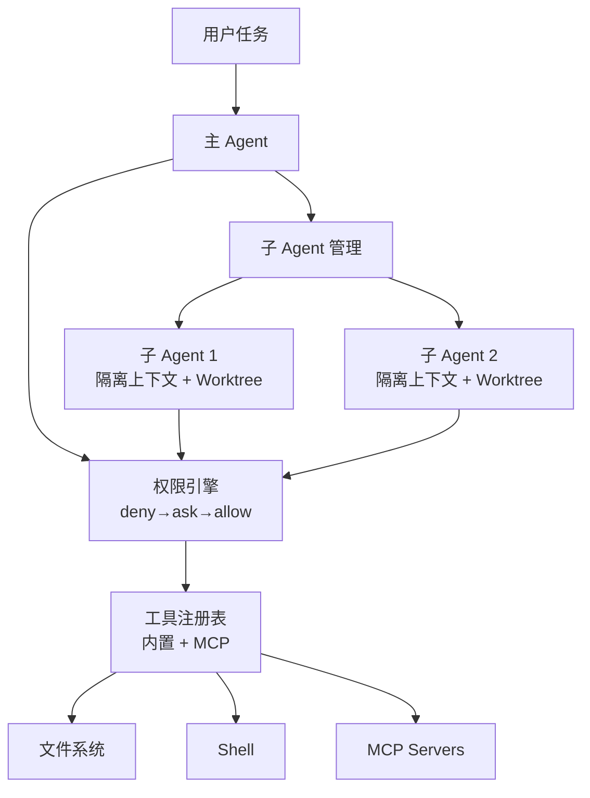

这是"动手构建"系列的最后一章——给 Mini-Harness 加上 MCP 集成和多 Agent 支持。

## 添加 MCP 客户端

### 最简 MCP Client

```python
import asyncio
import json
import subprocess

class SimpleMCPClient:
    """最小 MCP 客户端实现"""

    def __init__(self):
        self.servers = {}

    async def connect_stdio(self, name: str, command: str, args: list[str]):
        """通过 stdio 连接 MCP Server"""
        proc = await asyncio.create_subprocess_exec(
            command, *args,
            stdin=asyncio.subprocess.PIPE,
            stdout=asyncio.subprocess.PIPE,
        )
        self.servers[name] = {
            "type": "stdio",
            "process": proc,
            "tools": [],
        }
        await self._discover_tools(name)

    async def _discover_tools(self, name: str):
        """调用 tools/list 获取该 Server 的工具"""
        server = self.servers[name]
        request = json.dumps({
            "jsonrpc": "2.0",
            "method": "tools/list",
            "id": 1,
        })
        server["process"].stdin.write((request + "\n").encode())
        await server["process"].stdin.drain()
        response = await server["process"].stdout.readline()
        result = json.loads(response)
        server["tools"] = result.get("result", {}).get("tools", [])

    def get_all_tools(self) -> list[dict]:
        """获取所有 MCP Server 的工具"""
        all_tools = []
        for server in self.servers.values():
            all_tools.extend(server["tools"])
        return all_tools

    async def call_tool(self, tool_name: str, params: dict) -> str:
        """调用 MCP 工具"""
        for server in self.servers.values():
            for tool in server["tools"]:
                if tool["name"] == tool_name:
                    request = json.dumps({
                        "jsonrpc": "2.0",
                        "method": "tools/call",
                        "params": {"name": tool_name, "arguments": params},
                        "id": 2,
                    })
                    server["process"].stdin.write((request + "\n").encode())
                    await server["process"].stdin.drain()
                    response = await server["process"].stdout.readline()
                    return json.loads(response)["result"]["content"][0]["text"]
        return f"未找到 MCP 工具: {tool_name}"
```

### 集成到 Harness

```python
class HarnessWithMCP:
    def __init__(self):
        self.mcp = SimpleMCPClient()
        self.builtin_tools = ToolRegistry()
        self.permissions = PermissionEngine()

    async def start(self):
        """启动 Harness，连接 MCP Servers"""
        await self.mcp.connect_stdio("github", "npx",
            ["-y", "@anthropic/mcp-server-github"])
        await self.mcp.connect_stdio("postgres", "npx",
            ["-y", "@anthropic/mcp-server-postgres"])

    def get_all_tool_schemas(self) -> list[dict]:
        """合并内置工具 + MCP 工具"""
        builtin = self.builtin_tools.get_anthropic_format()
        mcp = self.mcp.get_all_tools()
        return builtin + mcp

    async def execute_tool(self, name: str, params: dict) -> str:
        """执行工具（内置或 MCP）"""
        if name in self.builtin_tools._tools:
            return self.builtin_tools.execute(name, params)
        return await self.mcp.call_tool(name, params)
```

Agent 不区分"内置工具"和"MCP 工具"——统一接口，统一调度。

## 添加多 Agent 支持

### 子 Agent 生成

```python
import uuid

class MultiAgentHarness(HarnessWithMCP):
    def __init__(self):
        super().__init__()
        self.sub_agents = {}
        self.max_depth = 3

    async def spawn_subagent(self, role: str, task: str,
                             tools: list[str], depth: int = 0) -> dict:
        """生成一个子 Agent 执行独立任务"""
        if depth >= self.max_depth:
            return {"error": "超过最大嵌套深度"}

        agent_id = f"agent-{uuid.uuid4().hex[:8]}"

        sub_context = {
            "system": f"你是 {role}。完成任务后返回结果。",
            "task": task,
            "tools": [t for t in self.get_all_tool_schemas()
                      if t["name"] in tools],
            "max_turns": 20,
            "depth": depth,
        }

        # 创建隔离 worktree
        worktree = None
        if "write_file" in tools:
            worktree = await self._create_worktree(agent_id)

        result = await self._run_sub_agent(sub_context, worktree)

        if worktree:
            await self._remove_worktree(worktree)

        return {
            "agent_id": agent_id,
            "role": role,
            "status": result["status"],
            "summary": result["summary"],
            "files_changed": result.get("files_changed", []),
        }

    async def _run_sub_agent(self, context: dict, worktree) -> dict:
        """在隔离环境中运行子 Agent"""
        messages = [{"role": "user", "content": context["task"]}]
        files_changed = []
        cwd = worktree.path if worktree else WORK_DIR

        for turn in range(context["max_turns"]):
            response = await self._call_model(
                system=context["system"],
                messages=messages,
                tools=context["tools"],
            )

            if response.stop_reason == "end_turn":
                return {
                    "status": "completed",
                    "summary": response.content[0].text,
                    "files_changed": files_changed,
                }

            for block in response.content:
                if block.type == "tool_use":
                    result = await self.execute_tool(
                        block.name, block.input)
                    if block.name == "write_file":
                        files_changed.append(block.input["path"])
                    messages.append({
                        "role": "user",
                        "content": [{"type": "tool_result",
                                     "tool_use_id": block.id,
                                     "content": result}]
                    })

        return {"status": "max_turns", "summary": "达到上限",
                "files_changed": files_changed}

    async def _create_worktree(self, agent_id: str):
        """创建隔离的 git worktree"""
        path = f"/tmp/harness-{agent_id}"
        branch = f"feature/{agent_id}"
        subprocess.run(["git", "worktree", "add", path, "-b", branch])
        return type('Worktree', (), {'path': path, 'branch': branch})()

    async def _remove_worktree(self, worktree):
        """回收 worktree"""
        subprocess.run(["git", "worktree", "remove",
                        worktree.path, "--force"])
```

## 完整的 Mini-Harness v3 架构



从 100 行的最小实现，到现在我们有了：
- 完整的 Agent Loop + auto-inject
- 工具注册表（内置 + MCP）
- 三级权限管道（deny → ask → allow）
- MCP 客户端（stdio/HTTP）
- 多 Agent 生成（独立上下文 + worktree 隔离）
- 深度限制 + 结果结构化回传

## 本章小结

- MCP Client 核心：连接 Server → 发现工具 → 代理调用
- Agent 不区分内置工具和 MCP 工具——统一接口
- 子 Agent 关键机制：独立上下文 + worktree 隔离 + 权限子集 + 深度限制
- 子 Agent 返回结构化结果，不是完整对话历史
- 从 100 行到 MultiAgentHarness——每一步都是增量
- 下一章：2026年Harness生态全景

---

**系列目录**：
- [第二十三章：添加工具系统与权限控制](./23-adding-tools-and-permissions.md)
- 第二十四章：添加MCP与多智能体支持 👈 当前位置
- [第二十五章：2026年Harness生态全景](../08-future/25-harness-ecosystem-2026.md) 👉 下一章

