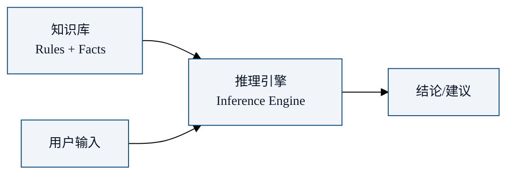
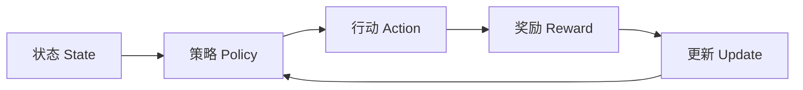

你有没有想过：今天的 Claude Code 能在终端里自主写代码、修bug、发PR——这个"智能体"是怎么一步步走到今天的？

要理解 Harness，得先理解 Agent。要理解 Agent，得先知道它从哪来。

## 什么是 Agent？

在 AI 领域，**Agent**（智能体）指一个能**自主感知环境、做出决策、执行动作**的系统。四个关键词：

- **自主性**：不是人在 loop 里一步步指挥
- **感知**：能"看到"环境状态（代码库、文件系统、API 响应...）
- **决策**：基于感知做出判断（该读哪个文件、该调哪个工具...）
- **执行**：把决策变成行动（写文件、跑命令、调 API...）

这个概念不是 2023 年 GPT-4 出来才有的。它跨越了 AI 的整个历史。

## 第一幕：符号 AI 时代（1950s-1980s）

### 1950：图灵测试 —— Agent 的哲学起点

Alan Turing 在 1950 年的论文《Computing Machinery and Intelligence》中提出：如果一台机器能在对话中让人类无法分辨它是机器还是人，那它就展示了"智能"。

这不是一个工程蓝图，但它定义了 Agent 的终极目标：**像人一样思考和行动**。

### 1956：Dartmouth 会议 —— AI 这个词诞生

John McCarthy 组织 Dartmouth 暑期研讨会，"Artificial Intelligence" 这个词第一次被正式使用。与会者包括 Marvin Minsky、Claude Shannon、Herbert Simon——这群人相信，人类智能的每一个方面都可以被精确描述，以至于可以用机器来模拟。

### 1960s-1970s：符号推理系统

早期 AI Agent 的核心思路是**符号推理**：用形式逻辑表示知识，用推理规则得出结论。

- **General Problem Solver (GPS, 1959)**：Newell 和 Simon 的通用问题求解器，试图用"手段-目的分析"解决任何形式化问题。它在简单问题上有效，但面对真实世界的复杂性立即崩溃。
- **SHRDLU (1968)**：Terry Winograd 的积木世界——一个能用自然语言理解和操控虚拟积木的 Agent。你可以说"把红色方块放到蓝色方块上面"，它照做。但它只能活在极简的积木世界里。
- **STRIPS (1971)**：斯坦福研究院的自动规划器，启发了后来所有规划算法的经典。Shakey the Robot 是第一个用 STRIPS 规划的移动机器人。

### 1970s-1980s：专家系统

知识工程的黄金时代：

- **MYCIN (1976)**：斯坦福的血液感染诊断系统，表现超过初级医生
- **XCON (1980)**：DEC 的计算机配置专家系统，每年省下 4000 万美元
- **DENDRAL**：从质谱数据推断分子结构

专家系统的核心架构是**知识库 + 推理引擎**——这正是现代 Agent 中 **Skills（技能）+ Agent Loop（循环）** 的远祖。

专家系统的致命弱点：
- **知识获取瓶颈**：每条规则都要人类专家手写
- **脆弱性**：超出知识范围立即失效
- **无学习能力**：不能从经验中改进

这些弱点，正是后来机器学习和 LLM 要解决的核心问题。

### 1980s-1990s：BDI 架构

**BDI (Belief-Desire-Intention)** 是 Michael Bratman 的哲学理论，后来被 Rao 和 Georgeff (1991) 形式化为 Agent 架构：

- **Belief（信念）**：Agent 对世界的认知（"我当前在哪个分支"）
- **Desire（欲望）**：Agent 想要达成的目标（"要修复这个 bug"）
- **Intention（意图）**：Agent 当前选择的行动计划（"先读文件，再定位代码，再修改"）

BDI 架构影响了后续几乎所有 Agent 框架的设计。今天 Claude Code 的 Plan → Work → Review 循环，本质上也是 BDI。

## 第二幕：统计学习时代（1990s-2010s）

### 1990s：反应式 Agent 与行为主义

Rodney Brooks 提出**包容架构 (Subsumption Architecture)**：智能不需要中央推理，而是来自多层简单行为（"躲避障碍物"在"探索"之上，"探索"在"漫游"之上）。

这是对符号 AI 的反叛——**没有知识库，没有推理引擎，只有行为层次**。

### 2000s：强化学习 Agent

- **TD-Gammon (1992)**：用强化学习自学西洋双陆棋，达到世界冠军水平
- **Deep Blue (1997)**：IBM 深蓝击败国际象棋世界冠军 Kasparov
- **AlphaGo (2016)**：DeepMind 击败围棋世界冠军李世石

强化学习 Agent 的架构：**状态 → 策略 → 行动 → 奖励 → 更新策略**。这是现代 Agent Loop 的另一个重要远祖。

### 2010s：深度学习 Agent

- **DQN (2013)**：DeepMind 用深度神经网络玩 Atari 游戏，从像素直接学习策略
- **AlphaZero (2017)**：不需要人类知识，纯自学掌握围棋、国际象棋、将棋
- **OpenAI Five (2018)**：在 Dota 2 中击败职业战队

这些 Agent 在一个**封闭的、规则明确的环境**里表现出色，但无法迁移到开放世界——它们不能帮你写代码、搜文档、处理 bug。

为什么？因为缺少两样东西：**语言理解**和**工具使用**。

## 第三幕：LLM 时代的前夜（2017-2022）

### 2017：Transformer 诞生

Google 的《Attention Is All You Need》论文引入 Transformer 架构——自注意力机制让模型能捕捉长距离依赖。BERT (2018) 和 GPT (2018) 都是它的孩子。

### 2020：GPT-3 —— "涌现能力"的发现

GPT-3 (175B 参数) 展示了一个惊人特性：**in-context learning**——不用 fine-tune，只靠在 prompt 里给几个示例，模型就能学会新任务。这让人们第一次认真思考：模型本身是否已经是一个"准 Agent"？

### 2021-2022：Agent 框架的萌芽

- **LangChain (2022)**：第一个主流 LLM Agent 框架，把模型、工具、记忆、链式调用包装成统一抽象
- **AutoGPT (2023.3)**：第一个自主 Agent 实验——给它一个目标，它自己分解、搜索、执行。虽然常常跑偏，但它点燃了 Agent 热潮
- **BabyAGI (2023.4)**：极简自主 Agent（100 行 Python），任务驱动的无限循环

这些早期框架的共同问题：**过于依赖 prompt engineering**，Agent 自主性差，很容易陷入死循环或产出无意义内容。

但方向是对的。接下来的问题变成了：**怎么让 Agent 真正可靠？**

答案就是：Harness。

## 历史的线索

回看这 70 年，Agent 的发展有一条清晰的线索：

| 时代 | 核心范式 | Agent 类型 | 致命弱点 |
|------|---------|-----------|---------|
| 1950s-80s | 符号推理 | 逻辑 Agent | 知识获取瓶颈 |
| 1990s | 反应式 | 行为 Agent | 无法抽象推理 |
| 2000s-10s | 统计学习 | 学习 Agent | 封闭环境限制 |
| 2020s | 预训练+提示 | LLM Agent | 可靠性差 |
| 2025-26 | **Harness 工程** | **可靠 Agent** | 仍在演进中 |

每一代解决了上一代的部分问题，又带来了新的问题。Harness 工程的出现，标志着 Agent 从"能不能做"进入了"**能不能可靠地做**"的新阶段。

## 本章小结

- Agent 的概念跨越 AI 的 70 年历史：从符号推理 → 专家系统 → BDI → 强化学习 → LLM Agent
- 每个时代的 Agent 都由**推理引擎 + 知识/工具**组成——结构惊人一致
- 符号 AI 的知识获取瓶颈、统计学习的封闭环境限制，都在 LLM 时代被突破
- LLM 解决了"理解"和"生成"，但可靠性问题需要通过 Harness 来解决
- 下一章：LLM 时代的 Agent 革命——2023-2026 的爆发

---

**系列目录**：
- 第一章：从符号AI到深度学习 —— Agent的70年简史 👈 当前位置
- [第二章：LLM时代的Agent革命 —— 2023-2026爆发期](./02-llm-era-agent-revolution.md) 👉 下一章
- [第三章：Harness概念溯源 —— "模型是大脑，Harness是身体"](../02-fundamentals/03-harness-concept-origin.md)
- [第四章：Harness的核心架构 —— 四层模型详解](../02-fundamentals/04-harness-core-architecture.md)
- [第五章：Harness vs Agent vs Model —— 三者关系辨析](../02-fundamentals/05-harness-agent-model-relationship.md)

