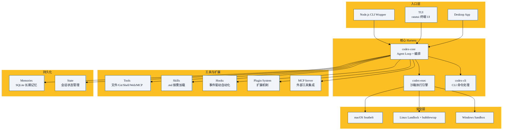

OpenAI 的 Codex CLI 是一个开源编码 Agent（MIT 许可），用 Rust 编写，100+ crates。和 Claude Code 一样，它的核心也是一套 Harness 架构——但设计哲学有显著不同。

本章基于 Codex CLI 的开源源码（本仓库 `source/codex/`）撰写。

## 总体架构

Codex 的核心架构是**模块化的 Rust crate 集合**：



## Codex vs Claude Code：架构差异

| 维度 | Codex | Claude Code |
|------|-------|-------------|
| **实现语言** | Rust (100+ crates) | TypeScript (单体) |
| **安全模型** | OS 级沙箱（三层） | 权限管道 |
| **终端 UI** | ratatui TUI | 文本 REPL |
| **记忆系统** | 两阶段并行流水线 | MEMORY.md |
| **状态管理** | SQLite 数据库 | 文件系统 |
| **扩展性** | 100+ 可独立使用的 crate | 单体应用内的模块 |
| **MCP 角色** | MCP Server + Client | MCP Client only |
| **代码理解** | 文本搜索 + MCP | LSP 语义层 + 文本搜索 |
| **开源** | ✅ MIT License | ❌ 闭源（源码泄露） |

## 第一层：Agent Loop

Codex 的循环模型和 Claude Code 本质相同，但带上了 Rust 的类型安全：

```rust
// 核心循环（简化）
impl AgentLoop {
    async fn run(&mut self, task: &str) -> Result<Output> {
        self.context.inject_system_prompt()?;
        self.context.inject_git_status()?;

        for turn in 0..self.max_turns {
            let response = self.model.chat(&self.context).await?;

            if response.is_text_completion() {
                return Ok(Output::Complete(response.text));
            }

            for tool_call in response.tool_calls {
                let result = self.execute_tool(tool_call).await?;
                self.context.add_tool_result(result);
            }

            if self.context.near_limit() {
                self.context.compact().await?;
            }
        }
        Err(Error::MaxTurnsReached)
    }
}
```

## 第二层：Tool System

### 工具的组织方式

Codex 的工具不是一个大模块，而是分布在各 crate 中：

| Crate | 工具 |
|-------|------|
| `codex-fs` | Read, Write, Glob, Grep |
| `codex-git` | Git operations |
| `codex-exec` | Shell execution (sandboxed) |
| `codex-web` | Web fetch, search |
| `codex-mcp` | MCP 工具代理 |
| `codex-notebook` | Jupyter notebook 操作 |

每个 crate 是**独立的 Rust 库**——可以被其他项目单独引用。这是 Codex 架构最大的亮点：**100+ 个可复用的 crate**。

```rust
// codex-fs 的公共 API 示例
pub fn read_file(path: &Path) -> Result<String>;
pub fn write_file(path: &Path, content: &str) -> Result<()>;
pub fn grep(pattern: &str, dir: &Path) -> Result<Vec<Match>>;
pub fn glob(pattern: &str, dir: &Path) -> Result<Vec<PathBuf>>;
```

## 第三层：安全模型（Codex 的杀手锏）

### OS 级沙箱

Claude Code 通过权限管道控制安全，Codex 则用 **OS 级沙箱**：

| 平台 | 沙箱技术 | 机制 |
|------|---------|------|
| **macOS** | Seatbelt (sandbox-exec) | 声明式策略文件，限制文件/网络/进程 |
| **Linux** | Landlock + bubblewrap | Landlock 限制文件访问 + bubblewrap 隔离命名空间 |
| **Windows** | Windows Sandbox | 轻量级虚拟机隔离 |

```bash
# macOS Seatbelt 策略示例
(version 1)
(deny default)
(allow file-read* (subpath "/Users/user/project"))
(allow process-fork)
(allow sysctl-read)
; 其他一切默认拒绝
```

### 为什么选择沙箱？

Claude Code 的权限管道是 **"允许/拒绝基于规则"**——模型请求 → 匹配规则 → 决定。
Codex 的沙箱是 **"OS 强制隔离"**——模型请求 → 在隔离环境执行 → 即使模型恶意也无法突破。

前者灵活（用户可以随时调整规则），后者更安全（OS 级别保证）。

## 记忆系统：两阶段流水线

Codex 的记忆系统是其另一个创新点：

```
Phase 1: 并行提取
├── 提取器 A: 关键决策
├── 提取器 B: 学习教训
├── 提取器 C: 代码模式
└── 提取器 D: 用户偏好

Phase 2: 全局整合
└── 去重 → 排序 → 合并 → 写入 SQLite
```

两阶段设计的核心优势：**并行提取避免了信息瓶颈**——4 个提取器同时工作，然后一次性整合。

记忆存储在 SQLite 中，结构化查询和检索远优于文本文件。

## Skills 与 Hooks

Codex 的技能系统和 Claude Code 高度相似（都是从 `anthropics/skills` 仓库学来的）：

```markdown
<!-- .codex/skills/my-skill/SKILL.md -->
---
name: my-skill
description: 我的自定义技能
---

# 技能内容...
```

Hooks 也类似——PreToolUse / PostToolUse / Stop 事件驱动。

## Plugin 系统

Codex 的插件系统比 Claude Code 更模块化：

```
.codex/plugins/
├── my-plugin/
│   ├── plugin.toml      # 插件元数据
│   ├── commands/        # 自定义命令
│   ├── skills/          # 自定义技能
│   ├── hooks/           # 事件钩子
│   ├── agents/          # 子代理定义
│   └── mcp-servers/     # MCP 服务器
```

## Dogfooding

Codex 的一个核心设计原则是 **"用 Codex 开发 Codex"**——Codex 开发团队用 Codex 来写 Codex 的代码。这保证了：
- 团队自己就是使用最深的用户
- 任何 UX 问题都会被团队自己遇到
- "吃自己的狗粮"是 Agent 质量最诚实的保障

## 本章小结

- Codex 的 Harness 以模块化 Rust crates 为基础，100+ 个独立可复用的组件
- OS 级沙箱（Seatbelt/Landlock/Windows Sandbox）是其最突出的安全特性
- 两阶段记忆流水线（并行提取 → 全局整合）实现了高效的知识持久化
- 和 Claude Code 的核心差异：Rust vs TypeScript、沙箱 vs 权限、开源 vs 闭源
- 两者设计哲学互补：Claude Code 体验优先，Codex 安全与模块化优先
- 下一章：OpenClaw 的 Harness 架构

---

**系列目录**：
- [第六章：Claude Code的Harness架构剖析](./06-claude-code-harness-architecture.md)
- 第七章：Codex的Harness架构剖析 👈 当前位置
- [第八章：OpenClaw的Harness架构](./08-openclaw-harness-architecture.md) 👉 下一章
- [第九章：开源Harness生态全景](./09-open-source-harness-ecosystem.md)

