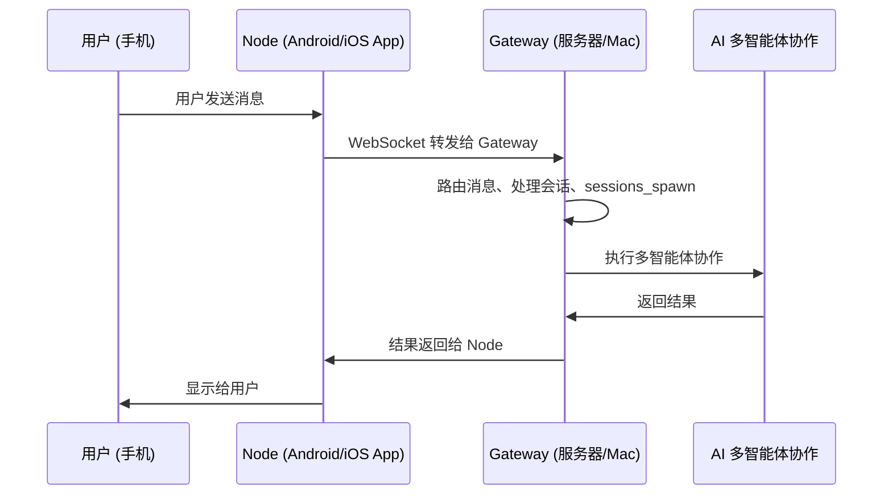

OpenClaw 设计为**分布式架构**：Gateway 网关跑在你的服务器或某台机器上，然后各个端侧设备（Mac/iOS/Android）作为"节点"连接上来，提供设备本地能力。本章我们讲解各个平台的安装、部署和使用。

## 架构角色说明

在开始之前，先理清两个概念：

| 角色 | 作用 | 运行位置 |
|------|------|----------|
| **Gateway** | 核心网关，处理消息路由、多智能体协作 | 通常跑在服务器、Mac 或 Linux 上 |
| **Node** | 端侧节点，提供设备原生能力（相机、屏幕、通知） | iOS/Android/macOS 客户端 |

一个典型的部署：

```
Gateway 跑在你的云服务器 → iOS 节点作为客户端 → 连接到 Gateway → iOS 提供相机、语音唤醒能力
```

### Gateway 和 Node 完整交互流程

当用户从手机发消息给 AI：



**分工总结**：

- **Gateway** 负责：消息路由、会话管理、多智能体协作、`sessions_spawn` 执行、模型调用
- **Node** 负责：UI 展示、用户输入、提供设备原生能力（相机、屏幕、麦克风、通知）给 AI 使用

---

## macOS

macOS 有原生菜单栏应用，是最完整的体验。

### 是什么

macOS 应用是 OpenClaw 的**菜单栏配套应用**：

- 常驻菜单栏，一点就开
- 管理所有系统权限（TCC 提示：通知、辅助功能、屏幕录制、麦克风）
- 可以本地运行 Gateway，也可以连接远程 Gateway
- 暴露 macOS 专属能力给 AI：Canvas 画布、相机、屏幕录制、`system.run` 命令执行

### 两种运行模式

#### 本地模式（默认）

```
macOS app → 本地启动 Gateway → 直接使用
```

**适合**：单机使用，Gateway 就跑在这台 Mac 上。

#### 远程模式

```
macOS app → SSH/Tailscale → 连接远程服务器上的 Gateway
```

**适合**：Gateway 跑在云服务器，Mac 只做客户端提供本地能力，省电。

### 安装

1. 从 [GitHub Releases](https://github.com/openclaw/openclaw/releases) 下载最新 `.dmg`
2. 打开 dmg，把 OpenClaw.app 拖到 Applications
3. 首次启动，按照提示完成权限授权
4. 设置里点"安装 CLI"，终端就能用 `openclaw` 命令

### 常用操作

**手动控制 Gateway（local 模式）**：

```bash
# 重启 Gateway
launchctl kickstart -k gui/$UID/ai.openclaw.gateway

# 停止 Gateway
launchctl bootout gui/$UID/ai.openclaw.gateway
```

**安装 Gateway 服务**（如果没自动装）：

```bash
openclaw gateway install
```

### 安全：Exec 审批

`system.run` 允许 AI 在你的 Mac 上执行 shell 命令，macOS app 提供了细粒度控制：

配置位置：`~/.openclaw/exec-approvals.json`

```json
{
  "version": 1,
  "defaults": {
    "security": "deny",
    "ask": "on-miss"
  },
  "agents": {
    "main": {
      "security": "allowlist",
      "ask": "on-miss",
      "allowlist": [{ "pattern": "/opt/homebrew/bin/rg" }]
    }
  }
}
```

- 默认拒绝，不在白名单的会弹框询问你
- 选"总是允许"自动加入白名单
- 环境变量会过滤，去掉危险变量

### 深度链接

支持 `openclaw://` 协议从其他 app 唤起：

```bash
open 'openclaw://agent?message=Hello%20from%20deep%20link'
```

---

## iOS

iOS 是端侧节点应用，需要连接到远程 Gateway 使用。

> 注意：目前是内部预览版本，还未公开发布。

### 是什么

- iOS app 作为节点，连接到 Gateway
- 暴露能力：Canvas 画布、屏幕快照、相机、位置、语音唤醒
- 需要 Gateway 运行在另一台设备（macOS/Linux/WSL2）

### 要求

- Gateway 已经在另一台设备启动
- 网络连通：
  - 同一局域网 → Bonjour 自动发现
  - 不同网络 → Tailscale 组网 + unicast DNS-SD
  - 都不行 → 手动填主机地址端口

### 快速开始

1. 启动 Gateway：
```bash
openclaw gateway --port 18789
```

2. 在 iOS app 设置里，选择发现到的 Gateway（或手动填地址）

3. 在 Gateway 主机上批准配对：
```bash
openclaw nodes pending
openclaw nodes approve <requestId>
```

4. 验证连接：
```bash
openclaw nodes status
```

### 能力

| 能力 | 说明 |
|------|------|
| **Canvas + A2UI** | 在 iOS 上渲染实时协作画布 |
| **相机拍照** | `camera.snap` 拍照传给 AI |
| **语音唤醒** | 设置里开启，语音唤起 AI |
| **屏幕快照** | 捕获屏幕内容 |

### 常见问题

- `NODE_BACKGROUND_UNAVAILABLE`：把 app 带到前台，画布/相机/屏幕命令需要前台
- `A2UI_HOST_NOT_CONFIGURED`：检查 Gateway 配置里的 `canvasHost`
- 配对没提示：用 `openclaw nodes pending` 手动批准
- 重装后连不上：Keychain 配对清了，重新配对

---

## Android

Android 也是端侧节点应用，需要连接到 Gateway 使用。

### 是什么

- Android app 作为 companion node
- Gateway 需要跑在其他机器（macOS/Linux/WSL2）
- 支持：聊天、Canvas、相机

### 快速开始

和 iOS 基本一致：

1. 启动 Gateway：
```bash
openclaw gateway --port 18789
```

2. Android app 里，设置 → 发现的 Gateway → 连接

3. Gateway 主机批准配对：
```bash
openclaw nodes pending
openclaw nodes approve <requestId>
```

4. 验证：
```bash
openclaw nodes status
```

### 连接保活

Android app 使用**前台服务**保持连接，会有一个持久通知，这是 Android 系统要求，无法避免。

### 能力

- **聊天**：和主会话历史共享，和 WebChat 一致
- **Canvas**：显示 HTML/JS 画布，AI 可以实时编辑
- **相机**：拍照/录像传给 AI

---

## Linux

Linux 完全支持运行 Gateway，原生伴侣应用还在计划中。

### 推荐部署方式

**Gateway 直接跑在 Linux**，这是最常见的服务器部署方式。

### 新手快速开始（VPS）

```bash
# 1. 安装 Node 22+

# 2. 安装 OpenClaw
npm i -g openclaw@latest

# 3. 安装 daemon 服务
openclaw onboard --install-daemon

# 4. 从你的笔记本 SSH 隧道
ssh -N -L 18789:127.0.0.1:18789 <user>@<host>

# 5. 打开浏览器配置
open http://127.0.0.1:18789/
```

### 安装 systemd 用户服务

OpenClaw 会自动安装 systemd 用户服务：

```bash
# 这几种方式都可以
openclaw onboard --install-daemon
# 或者
openclaw gateway install
# 或者
openclaw configure  # 交互式选择
```

### 自定义 systemd 配置

创建 `~/.config/systemd/user/openclaw-gateway.service`：

```ini
[Unit]
Description=OpenClaw Gateway (profile: default)
After=network-online.target
Wants=network-online.target

[Service]
ExecStart=/usr/local/bin/openclaw gateway --port 18789
Restart=always
RestartSec=5

[Install]
WantedBy=default.target
```

启用：

```bash
systemctl --user enable --now openclaw-gateway
```

### 注意事项

- Bun 不推荐用于生产 Gateway（WhatsApp/Telegram 有 bug），用 Node 22+
- 原生 Linux 伴侣应用还在计划中，欢迎贡献

---

## Windows (WSL2)

Windows 上推荐用 WSL2 运行 OpenClaw，体验最完整。

### 为什么 WSL2

- Gateway + CLI 跑在 Linux 里面，运行时和其他平台一致
- 工具链兼容性更好（Node/pnpm/各种二进制工具）
- 原生 Windows 支持还不完善

### 安装步骤

#### 1. 安装 WSL2 + Ubuntu

PowerShell (管理员)：

```powershell
wsl --install
# 或者指定版本
wsl --list --online
wsl --install -d Ubuntu-24.04
```

重启电脑，完成 Ubuntu 初始化。

#### 2. 开启 systemd（必须）

在 WSL 终端：

```bash
sudo tee /etc/wsl.conf >/dev/null <<'EOF'
[boot]
systemd=true
EOF
```

退出 WSL，PowerShell 重启：

```powershell
wsl --shutdown
```

重新打开 Ubuntu，验证：

```bash
systemctl --user status
```

看到正常输出就是对了。

#### 3. 在 WSL 里安装 OpenClaw

```bash
git clone https://github.com/openclaw/openclaw.git
cd openclaw
pnpm install
pnpm ui:build
pnpm build
openclaw onboard
```

跟着引导完成配置就好。

### 端口转发（让其他设备访问 WSL 里的 Gateway）

WSL 有独立虚拟网络，如果其他设备要访问 WSL 里的服务，需要配置端口转发。

PowerShell (管理员)：

```powershell
# 变量
$Distro = "Ubuntu-24.04"
$ListenPort = 18789
$TargetPort = 18789

# 获取 WSL IP
$WslIp = (wsl -d $Distro -- hostname -I).Trim().Split(" ")[0]
if (-not $WslIp) { throw "WSL IP not found." }

# 添加端口转发
netsh interface portproxy add v4tov4 listenaddress=0.0.0.0 listenport=$ListenPort `
  connectaddress=$WslIp connectport=$TargetPort

# 防火墙放行
New-NetFirewallRule -DisplayName "WSL Gateway $ListenPort" -Direction Inbound `
  -Protocol TCP -LocalPort $ListenPort -Action Allow
```

WSL 重启后需要重新执行这个脚本。

---

## 平台对比表

| 平台 | 角色 | 运行 Gateway | 作为 Node | 状态 |
|------|------|:----------:|:--------:|------|
| **macOS** | 菜单栏伴侣 | ✅ 支持 | ✅ 支持 | 稳定可用 |
| **iOS** | 移动客户端 | ❌ 不支持 | ✅ 支持 | 内部预览 |
| **Android** | 移动客户端 | ❌ 不支持 | ✅ 支持 | 开发中 |
| **Linux** | 服务器网关 | ✅ 推荐 | ⚠️ 无原生 app | 稳定可用 |
| **Windows** | WSL2 网关 | ✅ 推荐（WSL2） | ⚠️ 无原生 app | 可用 |

---

## 发现方式对比

Gateway 发现有三种方式：

| 方式 | 适用场景 | 跨网络 |
|------|----------|---------|
| **Bonjour/mDNS** | 同一局域网 | ❌ 不行 |
| **Tailscale DNS-SD** | 跨网络，同一 Tailnet | ✅ 支持 |
| **手动地址** | 知道明确 IP 端口 | ✅ 支持 |

---

## 最佳实践

1. **个人单机**：macOS 本地模式，最简单，所有东西都在一台机器
2. **云服务器部署**：Gateway 跑在 Linux 服务器，macOS/iOS/Android 作为节点连接，24 小时在线
3. **Windows 用户**：一定要用 WSL2，不要裸跑在 Windows，兼容性好很多
4. **跨网络访问**：用 Tailscale 组网，比暴露公网安全
5. **权限最小化**：macOS 只开需要的权限，不需要就关掉
6. **自动启动**：用 systemd（Linux）或 launchd（macOS）开机自动启动 Gateway

---

## 常见问题

### Q: iOS/Android 能直接跑 Gateway 吗？

A: 目前不行，设计上就是 iOS/Android 做 Node（端节点），Gateway 跑在服务器或 Mac 上。这样省电，算力也够。

### Q: Linux 有没有图形客户端？

A: 目前没有，欢迎社区贡献。命令行够用。

### Q: WSL2 里 Gateway 启动了，其他设备访问不了？

A: 检查：
1. WSL 里 `0.0.0.0` 绑定
2. Windows 防火墙放行了端口
3. 配置了端口转发把 Windows 端口转到 WSL

### Q: 移动端 app 哪里下载？

A: iOS 和 Android 目前还在开发中，关注 [OpenClaw GitHub](https://github.com/openclaw/openclaw) 发布。

---

## 本章小结

- OpenClaw 是分布式架构：Gateway 跑在服务端，各端设备作为 Node 提供能力
- macOS 有完整原生菜单栏应用，支持本地和远程两种模式
- iOS/Android 作为端侧 Node，连接到远程 Gateway，提供移动能力
- Linux 是推荐的服务器部署平台，用 systemd 托管 Gateway
- Windows 推荐用 WSL2，获得完整 Linux 体验
- 网络发现支持 Bonjour（局域网）、Tailscale（跨网）、手动配置

---

---

**系列目录**：
- [第一章：OpenClaw 是什么 —— 自托管个人 AI 助手的终极形态](./../01-intro/01-what-is-openclaw.md)
- [第二章：核心架构总览 —— Gateway 为什么是中心控制平面](./../01-intro/02-architecture-overview.md)
- [第三章：Gateway —— 核心网关服务到底做了什么](./../01-intro/03-gateway.md)
- [第四章：多渠道接入 —— 如何支持 25+ 聊天平台](./../01-intro/04-multi-channel-inbox.md)
- [第五章：ACP —— 如何对接外部 AI 客户端](./../01-intro/05-acp.md)
- [第六章：消息路由 —— 消息如何正确送到对的会话](./../01-intro/06-routing.md)
- [第七章：安全模型 —— 配对白名单如何保护你](./../01-intro/07-security-model.md)
- [第八章：为什么你需要一个多智能体框架 —— 单智能体的困境](./../02-multi-agent/08-why-you-need-multi-agent-framework.md)
- [第九章：sessions_spawn —— 多智能体协作的核心原语](./../02-multi-agent/09-sessions-spawn-core-primitive.md)
- [第十章：协作架构模式 —— 从 Master-Worker 到 Hub-and-Spoke](./../02-multi-agent/10-collaboration-architecture-patterns.md)
- [第十一章：隔离设计 —— 为什么每个子智能体需要独立会话](./../02-multi-agent/11-isolation-design.md)
- [第十二章：嵌套协作 —— 如何实现 Orchestrator-Worker 模式](./../02-multi-agent/12-nested-collaboration.md)
- [第十三章：实践案例 —— 从零构建一个代码评审团队](./../02-multi-agent/13-practical-case-code-review-team.md)
- 第十四章：platforms —— 全平台安装部署指南 👈 当前位置
- [第十五章：providers —— 各大模型提供者配置大全](./15-providers.md) 👉 下一章
- [第十六章：plugins —— 插件系统开发指南](./16-plugins.md)
- [第十七章： refactor —— OpenClaw 重构原则与工作流](./17-refactor.md)
- [第十八章：reference —— 完整配置、模板、CLI 命令参考](./18-reference.md)
- [第十九章：skills —— 技能系统核心概念与开发指南](./19-skills.md)
- [第二十章：ClawHub —— 技能市场如何分享和获取技能](./20-clawhub.md)
- [第二十一章：Canvas A2UI —— 实时可视化协作 workspace](./../04-client-ux/21-canvas.md)
- [第二十二章：语音唤醒 (Voice Wake) —— 语音交互体验](./../04-client-ux/22-voice-wake.md)
- [第二十三章：WebChat —— Gateway WebSocket 聊天界面](./../04-client-ux/23-webchat.md)
- [第二十四章：工具系统 (Tools) —— OpenClaw 工具调用框架设计](./../05-tools-automation/24-tools.md)
- [第二十五章：内置浏览器 —— 网页抓取和交互](./../05-tools-automation/25-browser.md)
- [第二十六章：Cron 自动化 —— 定时任务自动化](./../05-tools-automation/26-cron.md)
- [第二十七章：Onboarding —— 新手引导流程设计](./../05-tools-automation/27-onboarding.md)
- [第二十八章：blogwatcher —— 博客与 RSS 更新监控](./../06-builtin-skills/28-live-covers.md)
- [第二十九章：gh-issues —— GitHub Issues 自动修复编排](./../06-builtin-skills/29-gh-issues.md)
- [第三十章：coding-agent —— 调用外部编码代理](./../06-builtin-skills/30-coding-agent.md)
- [第三十一章：模型故障转移 (Model Failover) —— 如何提高可用性](./../07-ops-best-practices/31-failover.md)
- [第三十二章：调试技巧 —— 如何排查 OpenClaw 问题](./../07-ops-best-practices/32-debugging.md)
- [第三十三章：成本优化 —— 如何用模型分级降低总成本](./../07-ops-best-practices/33-cost-optimization.md)
- [第三十四章：部署运维 —— OpenClaw 网关生产环境最佳实践](./../07-ops-best-practices/34-deployment.md)
