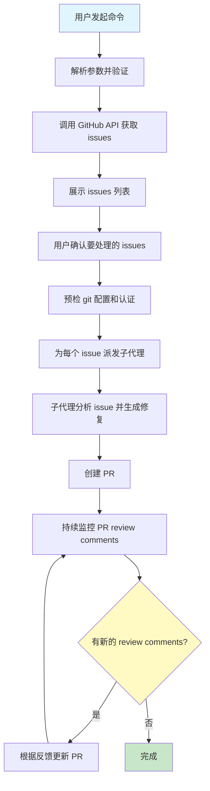
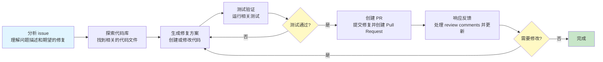

想象一下这样的场景：你的开源项目仓库里堆积了 50+ 个待处理的 bug 报告，每个都需要你手动分析、定位问题、编写修复代码、创建 PR、等待 review、再根据反馈修改……这听起来是不是很让人头疼？

更糟糕的是，其中很多问题其实是重复的、简单的，或者可以通过自动化方式解决的。你把大量时间花在这些重复性工作上，真正需要你深度思考的核心功能开发反而被挤占了。

如果有一个工具能够：
- 自动拉取 GitHub issues
- 智能分析每个问题
- 派发专门的子代理编写修复代码
- 自动创建 PR 并提交
- 持续监控 review comments 并处理反馈

你会不会觉得这简直是开发者的福音？

好消息是，OpenClaw 内置的 `gh-issues` skill 就能帮你实现这一切。

## `gh-issues` 是什么

当前内置 `gh-issues` 的描述是：

> 拉取 GitHub issues，派发 sub-agent 实现修复并打开 PR，然后持续监控并处理 review comments。

这说明它不是一个通用"分类工具"，而是一个**GitHub issue 编排 skill**。

## 当前依赖

这个 skill 在 frontmatter 里要求本机具备：

- `curl`
- `git`
- `gh`

并且需要：

```text
GH_TOKEN
```

作为主要认证环境变量。

### 安装 GitHub CLI

如果还没有安装 `gh` CLI，可以通过以下方式安装：

**macOS:**
```bash
brew install gh
```

**Linux:**
```bash
curl -fsSL https://cli.github.com/packages/githubcli-archive-keyring.gpg | sudo dd of=/usr/share/keyrings/githubcli-archive-keyring.gpg
echo "deb [arch=$(dpkg --print-architecture) signed-by=/usr/share/keyrings/githubcli-archive-keyring.gpg] https://cli.github.com/packages stable main" | sudo tee /etc/apt/sources.list.d/github-cli.list > /dev/null
sudo apt update
sudo apt install gh
```

**Windows:**
```powershell
winget install --id GitHub.cli
```

### 配置认证

安装完成后，需要认证：

```bash
gh auth login
```

或者直接设置环境变量：

```bash
export GH_TOKEN="your_github_personal_access_token"
```

## 当前支持的参数风格

skill 描述里直接给出了命令风格：

```text
/gh-issues [owner/repo] [--label bug] [--limit 5] [--milestone v1.0] [--assignee @me] [--fork user/repo] [--watch] [--interval 5] [--reviews-only] [--cron] [--dry-run] [--model glm-5] [--notify-channel -1002381931352]
```

这也说明它更像一个工作编排器，而不是聊天里临时批量分个类。

## 如何使用

`gh-issues` 是一个 OpenClaw 内置 skill，通过斜杠命令触发。你需要在**与 OpenClaw Gateway 连接的聊天客户端**中输入这些命令。

### 支持的聊天平台

OpenClaw 支持 25+ 聊天平台，你可以在以下任意平台中使用：

- **Telegram** - 通过 Telegram Bot 与 OpenClaw 交互
- **Discord** - 通过 Discord Bot 与 OpenClaw 交互
- **Slack** - 通过 Slack App 与 OpenClaw 交互
- **WebChat** - 通过内置的 WebSocket 聊天界面
- **其他平台** - 参见[第四章：多渠道接入](./../01-intro/04-multi-channel-inbox.md)

### 使用前提

在使用 `/gh-issues` 命令之前，需要确保：

1. **OpenClaw Gateway 已启动** - Gateway 服务正在运行
2. **已配置聊天平台** - 至少配置了一个聊天平台连接
3. **已完成配对** - 你的聊天账号已与 OpenClaw 配对（参见[第七章：安全模型](./../01-intro/07-security-model.md)）
4. **已安装依赖** - 本机已安装 `curl`、`git`、`gh` CLI
5. **已配置认证** - 已设置 `GH_TOKEN` 环境变量

### 命令格式

在聊天中输入的命令格式为：

```
/gh-issues [参数]
```

注意前面的 `/` 符号，这表示这是一个 skill 命令。

### 使用示例

在 Telegram 中使用：

```
你: /gh-issues openclaw/openclaw --label bug --limit 3

OpenClaw: 正在获取 openclaw/openclaw 仓库中标签为 bug 的 issues...
找到 5 个符合条件的 issues：
1. #123 - 修复登录页面崩溃问题
2. #124 - API 响应超时
3. #125 - 数据库连接池泄漏
4. #126 - 缓存失效问题
5. #127 - 内存泄漏

请确认要处理哪些 issues（输入编号，用逗号分隔，或输入 all 处理全部）：
```

在 Discord 中使用：

```
你: /gh-issues openclaw/openclaw --milestone v1.0 --dry-run

OpenClaw: [试运行模式] 将处理以下 issues：
- #100 - 实现用户认证
- #101 - 添加权限管理
- #102 - 完善日志系统

不会实际执行任何操作。如需执行，请移除 --dry-run 参数。
```

## 参数详解

### 必需参数

- `[owner/repo]` - 目标仓库，例如 `openclaw/openclaw`

### 可选参数

| 参数 | 说明 | 示例 |
|------|------|------|
| `--label` | 按标签筛选 issues | `--label bug` |
| `--limit` | 限制处理的 issue 数量 | `--limit 5` |
| `--milestone` | 按里程碑筛选 | `--milestone v1.0` |
| `--assignee` | 指定指派人 | `--assignee @me` |
| `--fork` | 指定 fork 仓库 | `--fork user/repo` |
| `--watch` | 持续监控模式 | `--watch` |
| `--interval` | 监控间隔（分钟） | `--interval 5` |
| `--reviews-only` | 仅处理 review comments | `--reviews-only` |
| `--cron` | 定时任务模式 | `--cron` |
| `--dry-run` | 试运行模式 | `--dry-run` |
| `--model` | 指定使用的模型 | `--model glm-5` |
| `--notify-channel` | 通知频道 ID | `--notify-channel -1002381931352` |

## 当前 skill 的工作流重点

从 `SKILL.md` 看，它的核心阶段包括：

1. **解析参数** - 解析用户输入的命令行参数
2. **调 GitHub API 拉取 issues** - 使用 GitHub API 获取符合条件的 issues
3. **展示并确认要处理哪些 issue** - 列出找到的 issues，等待用户确认
4. **跑 git / remote / token 预检** - 检查 git 配置、远程仓库和认证信息
5. **派发子代理处理代码修复** - 为每个 issue 派发独立的子代理进行修复
6. **跟进 PR review comments** - 持续监控 PR 的 review comments 并处理

## 快速开始

### 基础用法

处理指定仓库的 bug 标签 issues：

```bash
/gh-issues openclaw/openclaw --label bug --limit 3
```

### 指定里程碑

处理特定里程碑的 issues：

```bash
/gh-issues openclaw/openclaw --milestone v1.0 --limit 5
```

### 指派给自己

处理指派给自己的 issues：

```bash
/gh-issues openclaw/openclaw --assignee @me --limit 10
```

### 试运行模式

先看看会处理哪些 issues，不实际执行：

```bash
/gh-issues openclaw/openclaw --label bug --dry-run
```

### 持续监控模式

持续监控并处理新的 issues：

```bash
/gh-issues openclaw/openclaw --label bug --watch --interval 10
```

## 实际工作流程

### 完整修复流程



### 子代理工作流程

每个子代理会执行以下步骤：



## 使用场景

### 1. 批量修复简单 bug

```bash
/gh-issues openclaw/openclaw --label "easy-fix" --limit 10
```

### 2. 处理特定里程碑的遗留问题

```bash
/gh-issues openclaw/openclaw --milestone v1.0 --label "backlog" --limit 20
```

### 3. 持续监控新 issues

```bash
/gh-issues openclaw/openclaw --label bug --watch --interval 5 --notify-channel -1002381931352
```

### 4. 仅处理 PR review comments

```bash
/gh-issues openclaw/openclaw --reviews-only --limit 5
```

## 最佳实践

### 1. 使用试运行模式

在正式处理前，先用 `--dry-run` 查看会处理哪些 issues：

```bash
/gh-issues openclaw/openclaw --label bug --dry-run
```

### 2. 限制处理数量

避免一次性处理太多 issues，建议从小数量开始：

```bash
/gh-issues openclaw/openclaw --label bug --limit 3
```

### 3. 使用标签筛选

通过标签精确控制处理范围：

```bash
/gh-issues openclaw/openclaw --label "good-first-issue" --limit 5
```

### 4. 指定合适的模型

根据任务复杂度选择合适的模型：

```bash
/gh-issues openclaw/openclaw --label bug --model glm-4 --limit 5
```

### 5. 设置通知

在持续监控模式下设置通知，及时了解处理进度：

```bash
/gh-issues openclaw/openclaw --label bug --watch --notify-channel -1002381931352
```

## 常见问题

### Q1: 为什么没有处理任何 issues？

可能的原因：
- 没有符合条件的 issues
- GitHub token 权限不足
- 网络连接问题

解决方法：
- 使用 `--dry-run` 查看找到的 issues
- 检查 `GH_TOKEN` 是否有足够的权限
- 检查网络连接

### Q2: 子代理创建的 PR 质量不好怎么办？

可以：
- 使用更强大的模型：`--model glm-5`
- 减少同时处理的 issues 数量：`--limit 2`
- 手动 review PR 后再合并

### Q3: 如何停止持续监控模式？

在聊天中发送停止命令，或者直接终止 OpenClaw 进程。

### Q4: 可以处理私有仓库吗？

可以，但需要确保 `GH_TOKEN` 有访问该私有仓库的权限。

### Q5: 如何处理 fork 的 PR？

使用 `--fork` 参数指定 fork 仓库：

```bash
/gh-issues openclaw/openclaw --fork yourname/openclaw --limit 5
```

## 故障排除

### 认证失败

**错误信息：** `Authentication failed`

**解决方法：**
```bash
# 重新认证
gh auth login

# 或者检查环境变量
echo $GH_TOKEN
```

### Git 配置问题

**错误信息：** `Git configuration not found`

**解决方法：**
```bash
# 配置 git 用户信息
git config --global user.name "Your Name"
git config --global user.email "your.email@example.com"
```

### 权限不足

**错误信息：** `Insufficient permissions`

**解决方法：**
- 检查 GitHub token 是否有 `repo` 权限
- 确认你有访问目标仓库的权限

### 网络问题

**错误信息：** `Network error`

**解决方法：**
- 检查网络连接
- 如果使用代理，配置 git 代理：
```bash
git config --global http.proxy http://proxy.example.com:8080
```

## 安全注意事项

1. **保护 GitHub Token**
   - 不要在代码中硬编码 token
   - 使用环境变量或密钥管理工具
   - 定期轮换 token

2. **权限最小化**
   - 只授予必要的权限
   - 使用专门的 service account

3. **审查生成的 PR**
   - 不要自动合并所有 PR
   - 仔细 review 代码变更
   - 运行完整的测试套件

4. **限制处理范围**
   - 使用标签和限制参数
   - 避免处理敏感 issues

## 与其他章节的关联

- **第九章**：`sessions_spawn` - gh-issues 使用子代理协作的核心原语
- **第十章**：协作架构模式 - gh-issues 体现了 Master-Worker 模式
- **第十一章**：隔离设计 - 每个 issue 由独立的子代理处理
- **第十九章**：skills - gh-issues 是内置 skill 的典型示例
- **第二十六章**：Cron 自动化 - gh-issues 的定时任务模式

## 本章小结

- `gh-issues` 是一个用于批量处理 GitHub Issues、派发子代理修复并管理 PR 的内置 skill
- 它围绕 GitHub issues、子代理修复、PR 和 review comment 闭环展开
- 支持丰富的参数配置，可以灵活控制处理范围和行为
- 提供试运行、持续监控等多种工作模式
- 是 OpenClaw 多智能体协作和自动化能力的典型体现
