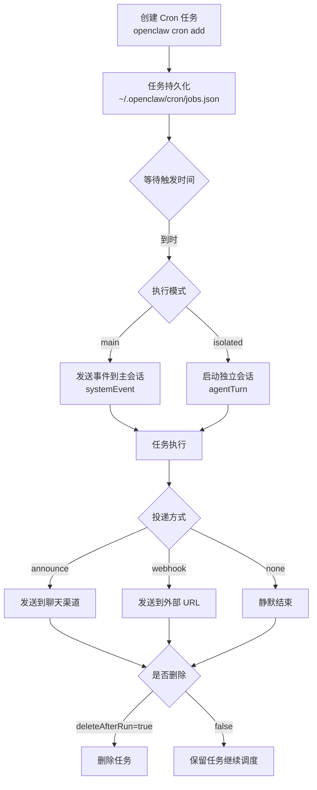

OpenClaw 的 cron 是一个**Gateway 内置调度器**，专门用于处理定时任务。与传统的 crontab 或需要外部依赖的方案不同，OpenClaw 的 cron 直接运行在 Gateway 内部，支持多种执行模式，并且任务会自动持久化。

推荐操作入口是 `openclaw cron ...` 命令，任务持久化在状态目录里，不需要手工维护复杂的配置文件。

## Cron 是如何工作的



官方文档的定义很明确：

- Cron 运行在 Gateway 内部
- 任务会持久化
- 可以唤醒主会话，也可以跑隔离会话
- 运行结束后可以 announce、webhook 或静默

默认存储位置：

```text
~/.openclaw/cron/jobs.json
```

推荐做法是**通过 CLI 或工具调用创建和编辑任务**，而不是手工维护一个长长的配置数组。

## 两种执行模式

### Main Session

主会话模式会把事件塞给 heartbeat 系统：

- `sessionTarget: "main"`
- `payload.kind: "systemEvent"`

这种模式适合：

- 晨报提醒
- 心跳内的常规巡检
- 希望复用主会话上下文的定时任务

**使用场景对比**：

| 场景 | 推荐模式 | 原因 |
|------|----------|------|
| 每日晨报推送到常用群组 | main | 上下文复用，用户在同一会话 |
| 紧急告警通知 | main | 需要立即被主会话感知 |
| 代码仓库健康检查 | isolated | 不需要打扰主会话，独立执行 |

### Isolated Session

隔离模式会在 `cron:<jobId>` 里跑独立 agent turn：

- `sessionTarget: "isolated"`
- `payload.kind: "agentTurn"`

这种模式适合：

- 噪音较大的后台任务
- 周期性抓取/总结
- 不想污染主会话历史的自动化

## 调度时间类型

OpenClaw 支持三种调度类型：

| 类型 | 说明 | 示例 |
|------|------|------|
| `at` | 一次性提醒 | `--at "2026-02-01T16:00:00Z"` |
| `every` | 固定间隔 | `--every "1h"` |
| `cron` | 标准 cron 表达式 | `--cron "0 7 * * *"` |

### at — 一次性任务

指定一个 ISO 8601 格式的绝对时间戳：

```bash
openclaw cron add \
  --name "Reminder" \
  --at "2026-02-01T16:00:00Z" \
  --message "Check the docs draft" \
  --delete-after-run
```

配合 `--delete-after-run` 使用，适合一次性提醒。

### every — 固定间隔任务

使用人类可读的间隔格式：

```bash
# 每 5 分钟
--every "5m"

# 每 1 小时
--every "1h"

# 每 2 天
--every "2d"
```

```bash
openclaw cron add \
  --name "Health check" \
  --every "30m" \
  --session isolated \
  --message "Check service health"
```

### cron — 标准周期任务

使用标准的 cron 表达式（5 个字段：分 时 日 月 周）：

```bash
# 每天早上 7 点
"0 7 * * *"

# 每周一上午 9 点
"0 9 * * 1"

# 每 5 分钟
"*/5 * * * *"

# 每月 1 号凌晨 2 点
"0 2 1 * *"

# 工作日每天上午 9 点
"0 9 * * 1-5"
```

配合 `--tz` 指定时区：

```bash
openclaw cron add \
  --name "Morning brief" \
  --cron "0 7 * * *" \
  --tz "Asia/Shanghai" \
  --session isolated \
  --message "Summarize overnight updates" \
  --announce \
  --channel slack \
  --to "channel:C1234567890"
```

## 任务投递方式

任务执行结束后，OpenClaw 支持三种投递方式：

| 模式 | 说明 | 适用场景 |
|------|------|----------|
| `announce` | 发送到聊天渠道 | 推送报告、通知用户 |
| `webhook` | 发送到外部 URL | 集成外部系统、数据分析 |
| `none` | 静默结束 | 纯后台处理、不需要通知 |

### announce — 推送到聊天渠道

```bash
openclaw cron add \
  --name "Daily report" \
  --cron "0 18 * * *" \
  --announce \
  --channel slack \
  --to "channel:C1234567890"
```

### webhook — 外部系统集成

如果你想让外部系统接收结果，而不是发回聊天渠道：

```bash
openclaw cron add \
  --name "Data export" \
  --cron "0 0 * * *" \
  --webhook https://api.example.com/cron-callback
```

**关键字段**：

- `delivery.mode` — 投递模式：`announce` / `webhook` / `none`
- `delivery.channel` — 聊天渠道：`slack` / `discord` / `telegram` 等
- `delivery.to` — 目标：频道 ID 或用户 ID
- `delivery.bestEffort` — 最佳投递（失败不重试）：`true` / `false`

## CLI 命令详解

### 创建任务

一次性提醒任务：

```bash
openclaw cron add \
  --name “Reminder” \
  --at “2026-02-01T16:00:00Z” \
  --session main \
  --system-event “Reminder: check the docs draft” \
  --wake now \
  --delete-after-run
```

定时晨报任务：

```bash
openclaw cron add \
  --name “Morning brief” \
  --cron “0 7 * * *” \
  --tz “America/Los_Angeles” \
  --session isolated \
  --message “Summarize overnight updates.” \
  --announce \
  --channel slack \
  --to “channel:C1234567890”
```

### 管理任务

```bash
# 列出所有任务
openclaw cron list

# 编辑任务
openclaw cron edit <job-id>

# 手动触发任务（不等待调度时间）
openclaw cron run <job-id>

# 查看任务执行历史
openclaw cron runs --id <job-id>

# 删除任务
openclaw cron rm <job-id>
```

## JSON 结构详解

当前概念层面的关键字段：

| 字段 | 说明 | 示例值 |
|------|------|--------|
| `schedule.kind` | 调度类型 | `"at"` / `"every"` / `"cron"` |
| `sessionTarget` | 执行模式 | `"main"` / `"isolated"` |
| `payload.kind` | 载荷类型 | `"systemEvent"` / `"agentTurn"` |
| `delivery.mode` | 投递方式 | `"announce"` / `"webhook"` / `"none"` |
| `wakeMode` | 唤醒模式 | `"now"` / `"next-heartbeat"` |
| `deleteAfterRun` | 运行后删除 | `true` / `false` |

完整的任务结构示例：

```json
{
  "id": "job-xxx",
  "name": "Morning brief",
  "schedule": {
    "kind": "cron",
    "expression": "0 7 * * *",
    "timezone": "Asia/Shanghai"
  },
  "sessionTarget": "isolated",
  "payload": {
    "kind": "agentTurn",
    "message": "Summarize overnight updates."
  },
  "delivery": {
    "mode": "announce",
    "channel": "slack",
    "to": "channel:C1234567890",
    "bestEffort": true
  },
  "wakeMode": "next-heartbeat",
  "deleteAfterRun": false
}
```

## 唤醒模式

`wakeMode` 决定了定时事件如何推动执行：

| 模式 | 行为 | 使用场景 |
|------|------|----------|
| `"now"` | 立即触发 heartbeat | 需要立即执行的紧急任务 |
| `"next-heartbeat"` | 等待下一个 heartbeat 周期 | 常规定时任务，资源友好 |

```bash
# 立即执行（紧急提醒）
--wake now

# 等待下次 heartbeat（常规任务，默认）
--wake next-heartbeat
```

## 故障排查

### 查看任务执行历史

```bash
openclaw cron runs --id <job-id>
```

输出示例：

```text
Runs for job "Morning brief" (job-xxx):

  #123  2026-02-01T07:00:00Z  success  2.3s
  #122  2026-01-31T07:00:00Z  success  2.1s
  #121  2026-01-30T07:00:00Z  failed   API timeout
```

### 常见问题

| 问题 | 原因 | 解决方法 |
|------|------|----------|
| 任务没有触发 | 时区配置错误 | 检查 `--tz` 参数是否正确 |
| webhook 调用失败 | URL 不可达或认证问题 | 检查目标服务日志和认证配置 |
| 任务一直重试 | delivery.bestEffort = false | 设置为 `true` 或修复失败原因 |
| 主会话污染 | 使用 main 模式执行高频任务 | 改用 isolated 模式 |

## 最佳实践

### 选择执行模式

- **日常报告、通知** → 使用 `main`，方便在同一个会话中查看
- **数据抓取、健康检查** → 使用 `isolated`，避免污染主会话历史

### 选择调度类型

- **一次性提醒** → `at` + `--delete-after-run`
- **高频监控** → `every`（如每 5 分钟）
- **周期性任务** → `cron`（如每天早上 7 点）

### 选择投递方式

- **需要用户感知** → `announce` 推送到常用群组
- **集成外部系统** → `webhook`
- **纯后台处理** → `none` 静默结束

### 资源优化

- 高频任务使用 `isolated` 模式 + `wake next-heartbeat`
- 避免 `wake now` 用于大批量任务，防止资源耗尽

## 版本迁移说明

如果你正在从旧版迁移，注意以下变化：

| 旧方式 | 新方式 |
|--------|--------|
| 手工维护配置数组 | `openclaw cron add/edit/list` |
| 旧式 skill 执行事件 | `systemEvent` / `agentTurn` 载荷 |
| `event.type = "command"` | 通过 CLI 创建任务 |
| 旧式通知字段 | `delivery` 对象 |

## 本章小结

- 当前 cron 是 Gateway 内建调度器，任务保存在 `~/.openclaw/cron/jobs.json`
- 主要执行模式：`main`（主会话）和 `isolated`（独立会话）
- 主要 schedule 类型：`at`（一次性）、`every`（间隔）、`cron`（周期）
- 主要 delivery 模式：`announce`（聊天）、`webhook`（外部）、`none`（静默）
- 正确操作入口是 `openclaw cron add/edit/list/run/rm` 命令

---

**系列目录**：
- [第一章：OpenClaw 是什么 —— 自托管个人 AI 助手的终极形态](./../01-intro/01-what-is-openclaw.md)
- [第二章：核心架构总览 —— Gateway 为什么是中心控制平面](./../01-intro/02-architecture-overview.md)
- [第三章：Gateway —— 核心网关服务到底做了什么](./../01-intro/03-gateway.md)
- [第四章：多渠道接入 —— 如何支持 25+ 聊天平台](./../01-intro/04-multi-channel-inbox.md)
- [第五章：ACP —— 如何对接外部 AI 客户端](./../01-intro/05-acp.md)
- [第六章：消息路由 —— 消息如何正确送到对的会话](./../01-intro/06-routing.md)
- [第七章：安全模型 —— 配对白名单如何保护你](./../01-intro/07-security-model.md)
- [第八章：为什么你需要一个多智能体框架 —— 单智能体的困境](./../02-multi-agent/08-why-you-need-multi-agent-framework.md)
- [第九章：sessions_spawn —— 多智能体协作的核心原语](./../02-multi-agent/09-sessions-spawn-core-primitive.md)
- [第十章：协作架构模式 —— 从 Master-Worker 到 Hub-and-Spoke](./../02-multi-agent/10-collaboration-architecture-patterns.md)
- [第十一章：隔离设计 —— 为什么每个子智能体需要独立会话](./../02-multi-agent/11-isolation-design.md)
- [第十二章：嵌套协作 —— 如何实现 Orchestrator-Worker 模式](./../02-multi-agent/12-nested-collaboration.md)
- [第十三章：实践案例 —— 从零构建一个代码评审团队](./../02-multi-agent/13-practical-case-code-review-team.md)
- [第十四章：platforms —— 全平台安装部署指南](./../03-core-concepts/14-platforms.md)
- [第十五章：providers —— 各大模型提供者配置大全](./../03-core-concepts/15-providers.md)
- [第十六章：plugins —— 插件系统开发指南](./../03-core-concepts/16-plugins.md)
- [第十七章： refactor —— OpenClaw 重构原则与工作流](./../03-core-concepts/17-refactor.md)
- [第十八章：reference —— 完整配置、模板、CLI 命令参考](./../03-core-concepts/18-reference.md)
- [第十九章：skills —— 技能系统核心概念与开发指南](./../03-core-concepts/19-skills.md)
- [第二十章：ClawHub —— 技能市场如何分享和获取技能](./../03-core-concepts/20-clawhub.md)
- [第二十一章：Canvas A2UI —— 实时可视化协作 workspace](./../04-client-ux/21-canvas.md)
- [第二十二章：语音唤醒 (Voice Wake) —— 语音交互体验](./../04-client-ux/22-voice-wake.md)
- [第二十三章：WebChat —— Gateway WebSocket 聊天界面](./../04-client-ux/23-webchat.md)
- [第二十四章：工具系统 (Tools) —— OpenClaw 工具调用框架设计](./24-tools.md)
- [第二十五章：内置浏览器 —— 网页抓取和交互](./25-browser.md)
- 第二十六章：Cron 自动化 —— 定时任务自动化 👈 当前位置
- [第二十七章：Onboarding —— 新手引导流程设计](./27-onboarding.md) 👉 下一章
- [第二十八章：blogwatcher —— 博客与 RSS 更新监控](./../06-builtin-skills/28-live-covers.md)
- [第二十九章：gh-issues —— GitHub Issues 自动修复编排](./../06-builtin-skills/29-gh-issues.md)
- [第三十章：coding-agent —— 调用外部编码代理](./../06-builtin-skills/30-coding-agent.md)
- [第三十一章：模型故障转移 (Model Failover) —— 如何提高可用性](./../07-ops-best-practices/31-failover.md)
- [第三十二章：调试技巧 —— 如何排查 OpenClaw 问题](./../07-ops-best-practices/32-debugging.md)
- [第三十三章：成本优化 —— 如何用模型分级降低总成本](./../07-ops-best-practices/33-cost-optimization.md)
- [第三十四章：部署运维 —— OpenClaw 网关生产环境最佳实践](./../07-ops-best-practices/34-deployment.md)

