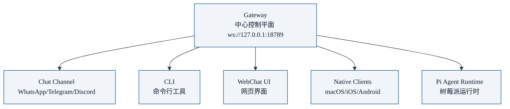

title: "第02章 OpenClaw 是什么 —— 自托管个人 AI 助手的终极形态"
date: 2026-05-10
category: "01 intro"
tags: []
collections: ["openclaw"]
weight: 2

你有没有想过：拥有一个**完全属于你自己**的 AI 助手，它可以：

- 在你所有常用的聊天平台（WhatsApp/Telegram/Discord/iMessage）上工作
- 本地运行，你的数据不会离开你的设备
- 支持多个 AI 模型，你可以自由切换 Anthropic/OpenAI/Google 等等
- 内置浏览器自动化，可以帮你自动浏览网页
- 支持定时任务，定期帮你收集信息
- 多智能体协作，让多个专家 AI 一起帮你解决复杂问题
- 开放技能市场，你可以随时安装新技能

这就是 **OpenClaw**。

## OpenClaw 定义

OpenClaw 是一个**开源自托管个人 AI 助手网关**，它帮你把 AI 能力接入到你日常使用的聊天平台，让 AI 随时随地陪伴你。

> "Multi-channel AI gateway with extensible messaging integrations" —— GitHub 官方定义

简单说：

- **网关**：中心服务，连接 AI 模型和聊天渠道
- **自托管**：你自己部署，数据完全在你控制之下
- **多渠道**：同一个 AI 助手，在 WhatsApp/Telegram/Discord/iMessage 都能用
- **可扩展**：通过技能和插件，随时增加新能力

## 核心架构

OpenClaw 采用中心网关架构：

所有组件都连接到中心 Gateway，Gateway 负责：

1. 接收来自各个渠道的用户消息
2. 路由给对应的 AI 会话处理
3. 调用 AI 模型
4. 把结果返回给用户

## 关键特性

让我们来看 OpenClaw 最重要的特性：

### 1. 25+ 消息平台支持

OpenClaw 开箱即用支持 **25+ 聊天平台**：

- 大平台：WhatsApp, Telegram, Discord, Slack, iMessage, Signal
- 其他：Matrix, Mastodon, Twitch, Line, 飞书等等

你不用换聊天软件，继续用你每天都用的那个，OpenClaw 直接接进去。

### 2. 本地优先，远程可访问

- Gateway 运行在你自己的服务器或者电脑上
- 默认本地访问，数据不出去
- 需要远程访问的时候，可以通过 Tailscale 或者 SSH 隧道暴露
- 完全你掌控

### 3. 多智能体协作原生支持

这是 OpenClaw 最核心的能力之一：

- `sessions_spawn` 核心原语，一键生成隔离子智能体
- 支持多种协作架构：Master-Worker, Hub-and-Spoke, Pipeline
- 深度限制防止上下文漂移
- 自动结果回传，不用你管

我们这个系列后面会专门讲这个。

### 4. 语音唤醒与语音交互

- macOS 支持语音唤醒，说一声"Open Claw"就能唤醒
- 语音输入语音输出
- 完全本地，不用云

### 5. Live Canvas A2UI

实时可视化协作工作区，AI 可以直接在画布上画图、排版，你可以实时看到进度。

### 6. 内置工具开箱即用

- **浏览器控制**：AI 可以帮你自动浏览网页、抓取内容
- **Cron 自动化**：定时任务，比如每天早上给你汇总新闻
- **文件读写**：读写本地文件
- **技能市场 ClawHub**：分享和获取社区技能

### 7. 安全模型

- 配对白名单：只有允许的发送者才能访问你的 AI
- DM 安全策略：阻止未认证发送者
- 所有数据你自己掌控，不会上传到第三方云

### 8. 模型故障转移

配置多个模型，一个失败了自动切到下一个，可用性更高。

## 谁适合用 OpenClaw

✅ **适合你如果**：

- 你想要一个**完全属于自己**的 AI 助手，不想把数据给大厂
- 你经常在聊天平台，想要 AI 就在聊天窗口里面
- 你需要处理复杂任务，想要多个 AI 专家分工协作
- 你想要自定义扩展，开发自己的技能

❌ **可能不适合**：

- 你想要开箱即用的 SaaS 服务，不想自己部署
- 你只需要简单的聊天，不需要多智能体协作

## OpenClaw 和其他 AI 助手有什么不一样

| 维度 | OpenClaw | ChatGPT APP | Claude.ai | 其他 self-hosted 框架 |
|------|----------|------------|-----------|----------------------|
| 自托管 | ✅ | ❌ | ❌ | ⚠️ 部分支持 |
| 多渠道接入 | ✅ 25+ | ❌ 单 APP | ❌ 单 APP | ❌ 一般只支持单渠道 |
| 原生多智能体 | ✅ | ⚠️ 有限 | ⚠️ 有限 | ❌ 很少原生支持 |
| 技能扩展 | ✅ 市场 | ❌ | ❌ | ⚠️ 需要自己写 |
| 语音唤醒 | ✅ | ✅ | ✅ | ❌ |

## 文档导航

OpenClaw 官方文档结构：

| 文档 | 内容 |
|------|------|
| **入门导航** | `onboarding` 引导你完成设置 |
| **平台指南** | Windows (WSL2), Linux, macOS, iOS, Android 各平台安装 |
| **架构** | Gateway + 协议模型架构概述 |
| **配置参考** | 完整配置键参考 |
| **操作手册** | Gateway 运行维护 |
| **远程访问** | SSH 隧道 / Tailscale 配置 |
| **故障排查** | 常见问题调试 |
| **安全指南** | 暴露服务前必读 |

你看完这个系列，就能对照官方文档，部署一个自己用的 OpenClaw，并且理解背后的设计原理。

## 本章小结

- OpenClaw 是**自托管个人 AI 助手网关**，让 AI 能力接入你日常聊天平台
- 中心 Gateway 连接各个渠道和 AI 运行时
- 核心特性：25+ 渠道支持、原生多智能体协作、本地优先、可扩展技能
- 接下来我们讲解核心架构，Gateway 为什么是中心控制平面

