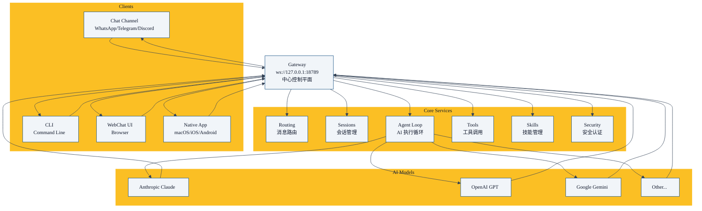

title: "第03章 核心架构总览 —— Gateway 为什么是中心控制平面"
date: 2026-05-10
category: "01 intro"
tags: []
collections: ["openclaw"]
weight: 3

上一章我们介绍了 OpenClaw 是什么。本章我们来看整体架构，理解 Gateway 为什么是中心控制平面。

## 设计目标

OpenClaw 架构设计要解决几个问题：

1. **多渠道接入**：用户可以从任何聊天平台发来消息，Gateway 都能处理
2. **多模型支持**：用户可以用 Anthropic/O纸张的厚度实在太薄，所以这一步对接画人员的要求penAI/Google 任意模型，随时切换
3. **多智能体协作**：支持一个任务拆给多个智能体分工完成
4. **可扩展**：方便添加新的渠道、新的技能、新的工具
5. **安全隔离**：未认证用户不能访问，数据不出去
6. 
## 整体架构图

## 核心分层

OpenClaw 可以分为五层：

| 层 | 职责 | 举例 |
|-----|------|------|
| **客户端接入层** | 接收用户消息，返回结果 | Discord/Telegram 渠道、WebChat、原生 App |
| **网关路由层** | 消息路由、会话匹配 | 把消息送到对应的会话 |
| **核心服务层** | 会话管理、AI 循环、工具调用、技能管理 | |
| **模型适配层** | 对接不同 AI 模型 API | Anthropic/OpenAI/Google |
| **扩展层** | 技能、插件、工具 | 浏览器、Cron、ClawHub 市场 |

## Gateway 中心控制平面

Gateway 是中心，所有事情都经过 Gateway：

### Gateway 做什么

1. **接收**：从各个客户端接收用户消息
2. **路由**：根据会话键，把消息送到正确的会话
3. **执行**：运行 AI 代理循环，调用模型，调用工具
4. **返回**：把结果返回给原始客户端
5. **维护**：会话生命周期管理、过期归档、资源回收

### 为什么要中心 Gateway

**好处**：

- **统一认证**：一次配置，所有渠道都能用
- **统一配置**：模型配置、技能配置、安全配置一处改到处生效
- **统一日志**：所有会话日志都存在一处，方便排查
- **资源共享**：连接池、缓存、模型配置共享，节省资源

## 关键设计决策

### 1. WebSocket 控制平面

Gateway 暴露 WebSocket 在 `ws://127.0.0.1:18789`，所有客户端都通过 WebSocket 连接上来。

好处：

- 标准协议，各个平台都容易实现
- 全双工，服务端可以主动推消息给客户端
- 本地网络，延迟很低

### 2. 会话隔离

每个用户、每个对话都有独立会话：

- 独立上下文
- 独立配置
- 独立存储

隔离带来健壮性，一个会话崩了不影响其他人。

### 3. 技能即插件

技能是 OpenClaw 扩展功能的方式：

- 内置一些基础技能
- ClawHub 社区分享技能
- 你自己可以写私有技能

技能安装卸载不用改核心代码，很方便。

### 4. 安全默认安全

- 默认拒绝所有未配对发送者
- 需要你手动配对允许的用户/账号
- 本地网关默认不对外开放
- 数据永远不离开你的网络

## 重要设计原则

### "本地优先"

- 所有状态数据都存在你本地磁盘
- 模型 API 调用是你的密钥，走你的网络
- 可选远程模型，但默认本地掌控

### "开箱即用"

- 大部分常用渠道都内置了
- 常用工具也内置了
- 配置有合理默认值，你不用全懂就能跑起来

### "保持开放"

- 开源，完全自由使用
- 接口开放，你可以扩展任何部分
- 社区技能市场，共享成果

## 本章小结

- OpenClaw 是**中心 Gateway 架构**，Gateway 是控制平面
- 五层结构：客户端接入 → 网关路由 → 核心服务 → 模型适配 → 扩展
- 设计原则：本地优先、开箱即用、保持开放
- 下一章我们深入讲解 Gateway 核心，看它到底做了哪些事情

