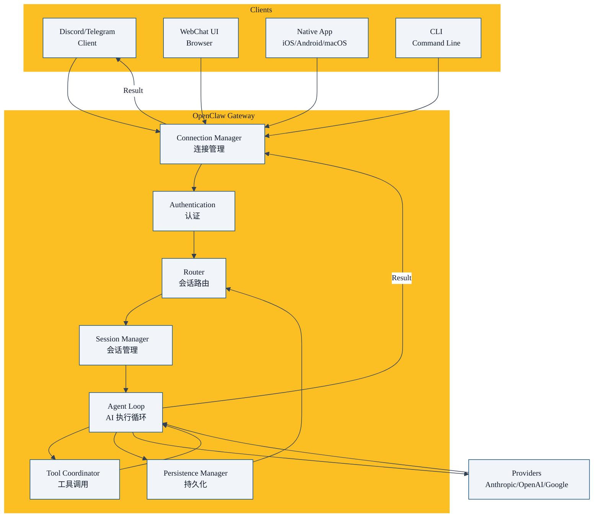

title: "第04章 Gateway —— 核心网关服务到底做了什么"
date: 2026-05-10
category: "01 intro"
tags: []
collections: ["openclaw"]
weight: 4
---

上一章我们说了 Gateway 是中心控制平面。本章我们深入讲解 Gateway 核心服务，看它具体做了哪些事情。

## Gateway 定位

Gateway 不是 AI 模型本身，它是**胶水层**：

- 把**聊天渠道**和**AI 模型**粘在一起
- 把**用户请求**路由到正确**会话**
- 管理**会话生命周期**
- 执行**AI 代理循环**
- 处理**工具调用**

你可以把 Gateway 理解成：**AI 代理的操作系统**。

## Gateway 整体架构



## Gateway 核心职责

我们一个个来看：

### 1. 连接管理：接受各个客户端连接

Gateway 启动之后，打开 WebSocket 端口 `18789`，等待各个客户端连接进来：

- 各个聊天渠道（Discord/Telegram 等）作为客户端连接上来
- WebChat UI 浏览器连接上来
- 原生 macOS/iOS/Android App 连接上来
- CLI 工具连接上来

WebSocket 是全双工，所以：

- 客户端可以主动发消息给 Gateway
- Gateway 可以主动发消息给客户端

不用客户端轮询，延迟更低。

### 2. 认证：验证连接合法性

每个新连接进来，Gateway 首先验证：

- 是否是合法的客户端
- 是否有权限接入

这是第一道安全闸门。

### 3. 消息接收：从客户端接收用户消息

认证通过之后，客户端就可以发用户消息过来了：

```
客户端 → Gateway: 用户消息
```

Gateway 接收之后，扔进队列，准备处理。

### 4. 路由：找到对应的会话

每条消息需要路由：

- 这个消息属于哪个会话？
- 会话存在吗？过期了吗？
- 需要新建会话吗？

路由算法根据：

- 频道 ID
- 发送者账号
- 线程 ID
- 会话键配置

算出唯一的会话键，找到对应的会话。

### 5. 会话管理：创建/加载/归档会话

找到会话之后：

- 如果是新消息，会话不存在 → 创建新会话
- 如果会话存在，没有过期 → 加载会话上下文
- 如果会话过期 → 归档旧会话，创建新会话

会话上下文包括：

- 完整对话历史
- 当前配置（模型、思考级别等）
- 元数据（创建时间、更新时间、发起者）

### 6. Agent 循环：执行 AI 交互

拿到会话上下文之后，Gateway 启动 Agent 循环：

```
while (!done) {
  1. 调用 AI 模型，传入上下文
  2. AI 返回，解析响应
  3. 如果 AI 要调用工具 → 执行工具，获取结果 → 回到 1
  4. 如果 AI 直接回复 → 结束循环
}
```

这是核心执行路径。整个循环都是 Gateway 驱动的。

### 7. 工具调用执行：调用本地工具

当 AI 需要调用工具的时候：

- Gateway 找到工具实现
- 验证工具权限（这个会话有权调用这个工具吗）
- 执行工具
- 获取工具结果
- 把结果放回给 AI，继续循环

### 8. 结果返回：把 AI 响应发给客户端

AI 给出最终回复之后，Gateway 把结果包装好，返回给原始客户端：

```
Gateway → 客户端: AI 回复
```

用户就在聊天窗口看到结果了。

### 9. 会话持久化：保存会话到磁盘

处理完消息之后，更新会话状态，保存到磁盘：

- 下次用户发消息，可以加载历史
- 排查问题可以回看历史
- 归档过期会话回收资源

## 并发模型

Gateway 怎么处理多个并发请求？

```
Gateway 主进程
├── 连接接受循环（主线程）
└── Worker 线程池
    ├── 任务 1：处理用户消息
    ├── 任务 2：处理用户消息
    └── ...
```

特点：

- **异步非阻塞**：IO 操作不阻塞主线程
- **并发控制**：子代理有全局并发限制，防止跑满资源
- **队列**：并发满了，放进队列等待，不拒绝

## 端口和地址

默认配置：

- 绑定：`127.0.0.1:18789`
- 只允许本地连接 → 外部默认连不上
- 需要远程访问 → 通过 SSH 隧道或者 Tailscale 暴露，不直接绑公网

这是默认安全策略，很好。

## 生命周期

Gateway 完整生命周期：

```
启动
  ↓
加载配置
  ↓
初始化各个模块
  ↓
打开 WebSocket 端口
  ↓
开始接受连接
  ↓
运行 ...
  ↓
收到关闭信号
  ↓
优雅关闭：
  停止接受新连接
  关闭现有连接
  保存所有会话
  退出
```

## 为什么 Gateway 要做成中心服务

你可能会问：为什么不每个渠道自己跑一个进程？

### 好处 1：统一配置

你改一次模型配置，所有渠道都生效，不用每个进程改一遍。

### 好处 2：资源共享

- HTTP 连接池共享
- 缓存共享
- 认证信息共享

节省资源。

### 好处 3：跨渠道协作

你可以从 Discord 发起任务，然后去 Telegram 看结果。因为会话都在同一个 Gateway，没问题。

### 好处 4：统一日志和监控

所有请求日志都在一个地方，排查问题方便。

## Gateway 不对什么负责

Gateway 不负责：

- ❌ 不训练 AI 模型
- ❌ 不提供 AI 模型，你需要自己有 API 密钥
- ❌ 不替你保管 API 密钥（密钥存在你本地磁盘，Gateway 用它调用）
- ❌ 不把你的数据发给第三方（除了你配置的 AI 模型 API）

Gateway 就是**干净的胶水层**，不偷你的数据，不云同步，完全你掌控。

## 本章小结

- Gateway 是 OpenClaw 核心，它是 AI 代理的操作系统
- 核心职责：连接管理 → 认证 → 路由 → 会话管理 → Agent 循环 → 工具调用 → 返回结果 → 持久化
- 并发处理：线程池 + 队列 + 并发限制
- 中心架构好处：统一配置、资源共享、跨渠道协作、统一日志
- Gateway 只是胶水层，不训练模型，不偷数据，完全你掌控


