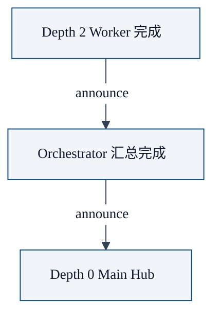

title: "第13章 嵌套协作 —— 如何实现 Orchestrator-Worker 模式"
date: 2026-05-10
category: "02 multi agent"
tags: []
collections: ["openclaw"]
weight: 13
---

前面我们说到，OpenClaw 默认 `maxSpawnDepth: 1`，也就是主智能体可以 spawn 子智能体，但子智能体不能再 spawn 子子智能体。

但是如果你打开 `maxSpawnDepth: 2`，就可以支持**两层嵌套**：

```text
Depth 0: Main Hub (orchestrator)
  ↳ spawn Depth 1: Team Coordinator
    ↳ spawn Depth 2: Worker
```

这就是 **Orchestrator-Worker 模式**（或者叫两层编排模式）。什么时候需要这个？本文来讲清楚。

## 什么场景需要嵌套

你有一个比较大的任务，比如：**调研 10 篇论文，总结它们的核心贡献**。

这个任务可以拆成：

1. **Team Coordinator**：拿到 10 篇论文列表，给每篇论文分配一个 Worker 去阅读总结
2. **Worker**：只读一篇论文，总结它的核心贡献
3. **Team Coordinator**：收集所有 Worker 的总结，汇总成一份完整的调研报告
4. **返回**给 Main Hub

如果不嵌套，Main Hub 要自己做拆分，自己 spawn 10 个 Worker，自己汇总。这在深度 1 也能做。

那什么时候需要嵌套？**当你的任务满足这两个条件**：

1. **任务可以二级拆分**：大任务拆成中任务，中任务拆成小任务
2. **二级拆分需要动态进行**：拆分逻辑本身需要 AI 理解，不能预先写死

这时候，把二级拆分逻辑交给一个深度 1 的 Orchestrator，让它去 spawn 深度 2 的 Workers，主 Hub 只需要等结果就行。

## OpenClaw 嵌套规则

OpenClaw 对嵌套有清晰的规则，核心就一条：

### 核心规则

**当 `当前深度 == maxSpawnDepth` 时，这个深度就是叶子节点，不能再 spawn 了**。

深度从 `0` 开始计数。我们以最常用的 `maxSpawnDepth = 2` 为例：

| Depth | 会话标识 | 可以 spawn 吗？ | 权限 |
|-------|----------|----------------|------|
| 0 | `agent:<id>:main` | ✅ 总是可以 spawn | 完整权限 |
| 1 | `agent:<id>:subagent:<uuid>` | ✅ 可以继续 spawn（因为 `1 < 2`） | 只开放 `sessions_spawn` 等必要会话工具 |
| 2 | `agent:<id>:subagent:<uuid>:subagent:<uuid>` | ❌ 不能再往下 spawn（因为 `2 == 2`，已是叶子节点） | 叶子节点，只执行任务 |

> **关于"叶子节点"**：这是树形结构的术语——树的最末端节点，没有子节点了。在这里就是指最底层负责执行具体任务的智能体，它不需要也不能再 spawn 更深的子智能体。

### 不同配置举例

| 你配置的 `maxSpawnDepth` | 允许的嵌套链路 | 哪个深度是叶子节点（不能 spawn） |
|-------------------------|----------------|---------------------------------|
| `1`（默认） | Depth 0 → Depth 1 | Depth 1 ❌ |
| `2`（推荐开嵌套） | Depth 0 → Depth 1 → Depth 2 | Depth 2 ❌ |
| `5`（不推荐） | Depth 0 → Depth 1 → Depth 2 → Depth 3 → Depth 4 → Depth 5 | Depth 5 ❌ |

> `maxSpawnDepth` 最大支持 5，但官方**强烈建议不要超过 2**。越深越容易上下文漂移。

### 会话标识格式规律

如果你真的需要开到深度 5，会话标识的规律是：**每往下一层，就多拼一段 `:subagent:<uuid>`**。完整格式示例（只展示路径长什么样，能不能 spawn 仍遵循上面的规则）：

| Depth | 会话标识格式 |
|-------|-------------|
| 0 | `agent:<id>:main` |
| 1 | `agent:<id>:subagent:<uuid>` |
| 2 | `agent:<id>:subagent:<uuid>:subagent:<uuid>` |
| 3 | `agent:<id>:subagent:<uuid>:subagent:<uuid>:subagent:<uuid>` |
| 4 | `agent:<id>:subagent:<uuid>:subagent:<uuid>:subagent:<uuid>:subagent:<uuid>` |
| 5 | `agent:<id>:subagent:<uuid>:subagent:<uuid>:subagent:<uuid>:subagent:<uuid>:subagent:<uuid>` |

简单记：**Depth = N，就有 N 个 `subagent` 段**。

## 结果回传链

嵌套的结果是自动回传的，不用你操心：



每一层只处理它直接孩子的结果。逻辑清晰，不会乱。

## 权限自动适配

OpenClaw 会根据深度自动适配权限：

- **Depth 1（当 `maxSpawnDepth >= 2`）**：会开放 `sessions_spawn`、`subagents`、`sessions_list`、`sessions_history`，让它能管理自己的孩子
- **Depth 2**：永远不给 `sessions_spawn` 权限，不能再嵌套了

这是自动的，不用你配置。

## 级联停止

如果你要停止一个上层会话，所有它 spawn 的下层会话都会被自动停止：

- `/stop` 在主会话 → 停止所有深度 1，级联停止所有深度 2
- `/subagents kill <id>` → 停止这个深度 1，级联停止它所有深度 2

不会留下僵尸会话。

## 一个完整例子：调研多篇论文

我们来看一个实际例子：

### 配置

嵌套深度配置写在你的**主配置文件** `~/.openclaw/openclaw.json` 的 `agents.defaults.subagents` 下：

```json5
{
  agents: {
    defaults: {
      subagents: {
        maxSpawnDepth: 2,      // 允许两层嵌套
        maxChildrenPerAgent: 10, // 每个 orchestrator 最多 10 个并发工人
        maxConcurrent: 8,      // 全局最多 8 个并发
      },
    },
  },
}
```

### 执行流程

```typescript
// Depth 0: Main Hub
// 用户说：帮我调研这 10 篇论文，总结核心贡献
sessions_spawn({
  task: `这里有 10 篇论文 URLs，请你：
1. 给每篇论文分配一个 worker
2. 让每个 worker 下载论文，提取核心贡献
3. 收集所有结果，按论文排序输出总结
`,
  agentId: "paper-research-orchestrator",
  mode: "run",
  label: "Paper research orchestration",
});

// Depth 1: paper-research-orchestrator
// 拆分任务，给每篇论文 spawn 一个 worker
for (const paper of papers) {
  sessions_spawn({
    task: `下载这篇论文 ${paper.url}，阅读它，总结核心贡献，不超过 300 字`,
    agentId: "paper-reader-worker",
    mode: "run",
  });
}

// 等待所有 workers 完成，汇总结果
// announce 回传给 Main Hub
```

就是这么简单。

## 什么时候该开 maxSpawnDepth = 2

**打开**当且仅当：你需要一个中间编排层来动态拆分任务。

常见场景：

- ✅ 批量处理多个相似任务（比如多篇论文、多个 PR、多个文件）
- ✅ 二级任务拆分（编排器负责拆分，工人负责执行）
- ✅ Map-Reduce 模式（Map 并行，Reduce 汇总）

**不要打开**当：

- ❌ 你只是主 Hub 直接 spawn 几个专家 → 深度 1 足够
- ❌ 你觉得越深越牛 → 越深风险越大，上下文漂移概率越高
- ❌ 尝试三层以上嵌套 → OpenClaw 允许但不推荐，生产环境尽量避免

## 嵌套的成本和风险

### 成本

- 多一层嵌套，就多一层上下文传递，多一点 token 消耗
- Orchestrator 也要占一个并发位置

### 风险

**上下文漂移**：每多一层，需求就可能走形一点。比如：

```
Main: "我要一个能排序的链表"
  ↳ Orchestrator 理解："用户需要一个高效的有序数据结构"
    ↳ Worker 实现："红黑树，因为它保证 O(log n) 复杂度"
```

最后回来一个红黑树，但其实用户只要一个简单的数组插入排序就能满足需求。

** mitigation 方法**：

1. **尽量不要超过两层** —— 两层足够绝大多数场景
2. **需求描述在每一层都要保留原文** —— Orchestrator 把用户原文传给 Worker，不要自己重写
3. **结果回传的时候，Orchestrator 不要修改 Worker 结果，只汇总** —— 减少信息变形

## 最佳实践总结

| 项目 | 建议 |
|------|------|
| `maxSpawnDepth` | 默认 1，真需要再开 2，不要超过 2 |
| `maxChildrenPerAgent` | 默认 5，批量任务可以开到 10，不要太多 |
| `maxConcurrent` | 根据你的网关 capacity 调整，默认 8 |
| 需求传递 | 尽量传原文，减少中间层理解变形 |
| 结果汇总 | Orchestrator 少加工，保持原始结果 |

## 本章小结

- 嵌套协作就是 Orchestrator 再 spawn Worker，实现二级拆分
- OpenClaw 有清晰的深度规则和权限自动适配
- 结果回传和停止都是自动级联的，不用你操心
- 生产环境推荐最大深度 2，不要更深
- 适合批量处理、Map-Reduce、动态二级拆分场景


