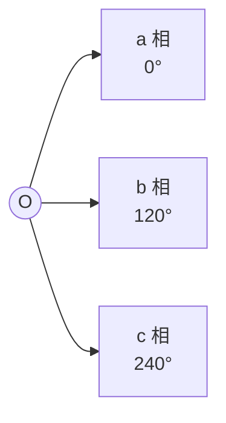
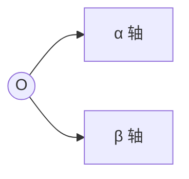
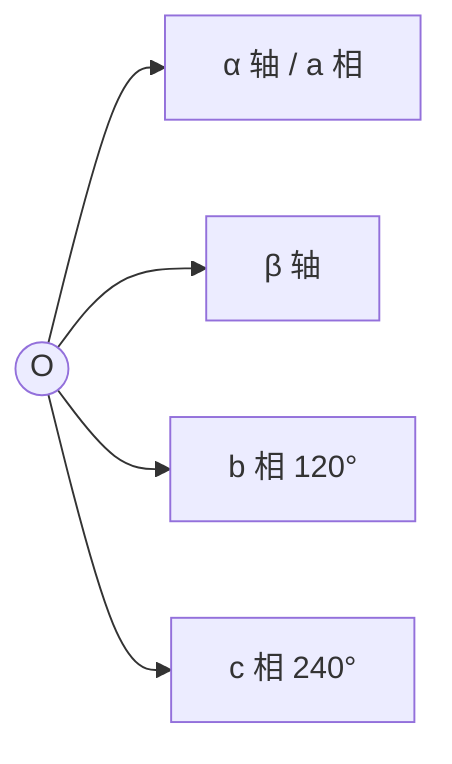
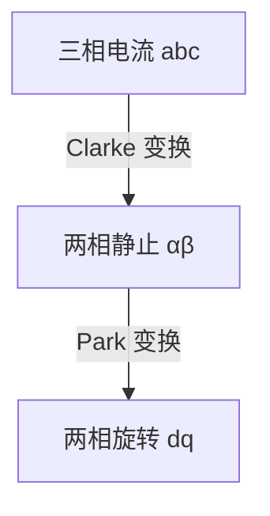

## 变换目的

将三相静止坐标系 (abc) 变换为两相正交静止坐标系 (αβ)，便于计算和控制。

**原因**：
1. 三相存在耦合（相互影响）
2. 三相参数对称，冗余一相
3. 两相正交独立控制，数学简化

---

## 坐标系定义

### 三相静止坐标系 (abc)



- **a 相**：水平向右 (0°)
- **b 相**：a 相逆时针 120°
- **c 相**：a 相逆时针 240°

### 两相静止坐标系 (αβ)



- **α 轴**：水平向右，与 a 相重合
- **β 轴**：垂直向上，与 α 轴正交 90°

---

## 变换公式

### 等功率变换（常用）

**正向变换** (abc → αβ):

```
i_α = (2/3) × [i_a - (1/2) × i_b - (1/2) × i_c]
i_β = (2/3) × [0 × i_a + (√3/2) × i_b - (√3/2) × i_c]
```

**简化形式**（利用 i_a + i_b + i_c = 0）:

```
i_α = i_a
i_β = (1/√3) × (i_b - i_c)
```

### 等幅值变换（需注意）

某些应用使用等幅值变换，变换后幅值不变：

```
i_α = (2/3) × [i_a - (1/2) × i_b - (1/2) × i_c]
i_β = (2/3) × [(√3/2) × i_b - (√3/2) × i_c]
```

**幅值差异**：等功率变换的幅值是等幅值的 √(2/3) 倍

---

## 逆变换 (αβ → abc)

```
i_a = i_α
i_b = (-1/2) × i_α + (√3/2) × i_β
i_c = (-1/2) × i_α - (√3/2) × i_β
```

---

## 矩阵形式

### 正向 Clarke 变换矩阵

```
[i_α]   [  1       -1/2        -1/2    ] [i_a]
[i_β] = [  0      √3/2      -√3/2   ] [i_b]
[i_0]   [1/√3    1/√3        1/√3     ] [i_c]
```

**注**：i_0 为零序分量，平衡系统中为零。

### 逆 Clarke 变换矩阵

```
[i_a]   [   1        0      ] [i_α]
[i_b] = [ -1/2     √3/2   ] [i_β]
[i_c]   [ -1/2    -√3/2   ]
```

---

## 时空矢量图



空间矢量合成：`Is = i_a·e^(j0) + i_b·e^(j120°) + i_c·e^(j240°)`

**物理意义**：
- 三相电流可以合成一个旋转空间矢量
- 该矢量的 α 分量为 i_α，β 分量为 i_β
- 矢量幅值：|Is| = √(i_α² + i_β²)
- 矢量角度：θ = atan2(i_β, i_α)

---

## 代码实现 (C++)

```cpp
// Clarke 变换
typedef struct {
    float alpha;
    float beta;
} AlphaBeta_t;

AlphaBeta_t clarke_transform(float ia, float ib, float ic) {
    AlphaBeta_t ab;

    // 利用三相和为零简化
    ab.alpha = ia;
    ab.beta = (1.0f / sqrtf(3.0f)) * (ib - ic);

    return ab;
}

// 逆 Clarke 变换
typedef struct {
    float a;
    float b;
    float c;
} ABC_t;

ABC_t inverse_clarke_transform(float alpha, float beta) {
    ABC_t abc;

    abc.a = alpha;
    abc.b = -0.5f * alpha + (sqrtf(3.0f) / 2.0f) * beta;
    abc.c = -0.5f * alpha - (sqrtf(3.0f) / 2.0f) * beta;

    return abc;
}
```

---

## 代码实现 (Python)

```python
import numpy as np

def clarke_transform(ia, ib, ic):
    """Clarke 变换: abc -> αβ"""
    alpha = ia
    beta = (1 / np.sqrt(3)) * (ib - ic)
    return alpha, beta

def inverse_clarke_transform(alpha, beta):
    """逆 Clarke 变换: αβ -> abc"""
    a = alpha
    b = -0.5 * alpha + (np.sqrt(3) / 2) * beta
    c = -0.5 * alpha - (np.sqrt(3) / 2) * beta
    return a, b, c

# 示例：平衡三相
ia, ib, ic = 1, -0.5, -0.5  # 和为0
alpha, beta = clarke_transform(ia, ib, ic)
print(f"α = {alpha:.3f}, β = {beta:.3f}")

# 验证逆变换
a, b, c = inverse_clarke_transform(alpha, beta)
print(f"a = {a:.3f}, b = {b:.3f}, c = {c:.3f}")
```

---

## 实例分析

### 例1：单相导通

```
i_a = 1, i_b = 0, i_c = 0
```

计算：
```
i_α = i_a = 1
i_β = (1/√3) × (i_b - i_c) = 0

结果：矢量在 α 轴上，幅值为1
```

### 例2：两相导通

```
i_a = 1, i_b = -1, i_c = 0
```

计算：
```
i_α = i_a = 1
i_β = (1/√3) × (i_b - i_c) = -1/√3 ≈ -0.577

结果：矢量在第四象限
幅值 = √(1² + 0.577²) ≈ 1.155
角度 = atan2(-0.577, 1) ≈ -30°
```

### 例3：平衡三相旋转

```
i_a = cos(ωt)
i_b = cos(ωt - 120°)
i_c = cos(ωt + 120°)
```

结果：
```
i_α = 1.5 × cos(ωt)
i_β = 1.5 × sin(ωt)

结果：旋转矢量，幅值恒定 1.5，速度 ω
```

---

## 与 Park 变换的关系



- **Clarke**：静止坐标系，不随转子旋转
- **Park**：旋转坐标系，随转子旋转

---

## 常见问题

### Q1: 为什么 Clarke 变换能简化计算？

**答**：
1. 三相相互耦合，一相变化影响其他相
2. 两相正交独立，α 和 β 可以独立控制
3. 减少变量数量（3→2）

### Q2: 等功率 vs 等幅值，选哪个？

**答**：
- **等功率**：保持功率不变，变换简单（用于 FOC）
- **等幅值**：保持幅值不变，便于观测
- FOC 中常用等功率变换

### Q3: 不平衡三相怎么办？

**答**：
- 不平衡时 i_a + i_b + i_c ≠ 0
- 需要完整的三相变换公式
- 会产生零序分量 i_0

---

## 参考资源

- [SimpleFOC 坐标变换](https://docs.simplefoc.com/foc_theory)
- [TI Clarke/Park 教程](https://www.ti.com/)
- [Wikipedia: Alpha–beta transformation](https://en.wikipedia.org/wiki/Alpha%E2%80%93beta_transformation)
