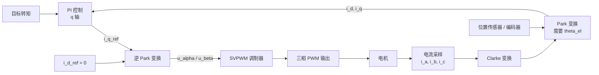
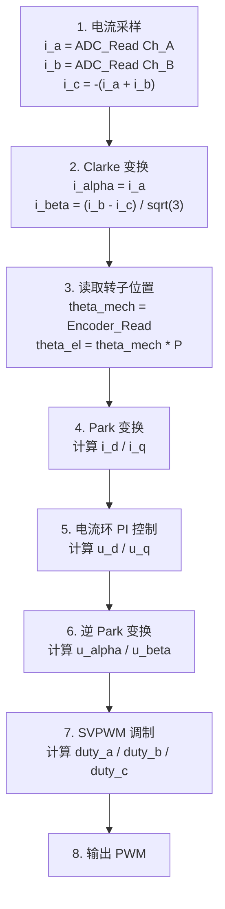

## 核心思想

FOC (Field Oriented Control) 通过坐标变换，将交流电机控制等效为直流电机控制。

**类比**：
- 有刷直流电机：电刷和换向器物理上保持 90°
- 无刷电机 FOC：通过算法电子上保持 90°

---

## 为什么需要 FOC

### 传统六步换相的问题

方波控制（六步换相）的主要问题：

- 每 60° 换相一次
- 转矩脉动大（约 10-20%）
- 电流波形非正弦
- 噪声大，效率低

### FOC 的优势

FOC 控制的优势：

- 连续换相（角度连续）
- 转矩平滑（脉动 < 2%）
- 电流波形正弦
- 噪声低，效率高（85-95%）
- 动态响应快

---

## FOC 核心原理

### 最大力条件

定子磁场与转子磁场保持 90° 时，产生最大电磁力：

```
F = B × I × L × sin(θ)

其中：
F = 电磁力 (N)
B = 磁通密度 (T)
I = 电流 (A)
L = 导体长度 (m)
θ = 定子磁场与转子磁场的夹角
```

**最大力条件**：θ = 90°，sin(90°) = 1

```
F_max = B × I × L
```

### FOC 如何保持 90°

1. **位置检测**：通过编码器/传感器获得转子位置 θ
2. **坐标变换**：将定子电流变换到旋转坐标系
3. **解耦控制**：独立控制 d-q 轴电流
4. **保持 i_d = 0**：让所有电流用于产生转矩

---

## FOC 控制框图



---

## FOC 控制步骤

### 步骤 1：电流采样

测量三相电流 i_a, i_b, i_c：

```
i_a + i_b + i_c = 0  (Y 型连接)

可以只测量两相，计算第三相：
i_c = -(i_a + i_b)
```

### 步骤 2：Clarke 变换

三相静止 → 两相静止：

```
i_α = i_a
i_β = (1/√3) × (i_b - i_c)
```

### 步骤 3：Park 变换

两相静止 → 两相旋转：

```
i_d = i_α × cos(θ_el) + i_β × sin(θ_el)
i_q = -i_α × sin(θ_el) + i_β × cos(θ_el)
```

**其中 θ_el**：转子电角度（从位置传感器获得）

### 步骤 4：PI 控制

```
i_d_error = i_d_ref - i_d
i_q_error = i_q_ref - i_q

u_d = PI_d(i_d_error)
u_q = PI_q(i_q_error)
```

**控制策略**：
- **i_d_ref = 0**：最大转矩控制（表贴式永磁）
- **i_d_ref < 0**：弱磁控制（高速）
- **i_q_ref**：根据目标转矩计算

### 步骤 5：逆 Park 变换

```
u_α = u_d × cos(θ_el) - u_q × sin(θ_el)
u_β = u_d × sin(θ_el) + u_q × cos(θ_el)
```

### 步骤 6：SVPWM 调制

```
(u_α, u_β) → SVPWM → 三相 PWM 输出
```

---

## FOC 的 d-q 轴控制

### d 轴控制（励磁控制）

| 策略 | 优点 | 代价 |
|---|---|---|
| `i_d = 0`（最大转矩/安比） | 控制简单；所有电流用于转矩；适用于表贴式永磁 (SPM) | 高速弱磁能力有限 |
| `i_d < 0`（弱磁） | 提高转速范围；适用于高速运行；可提高电压利用率 | 转矩密度降低 |

### q 轴控制（转矩控制）

`τ = k_t × i_q`

`i_q` 与转矩成正比：

- `i_q` 增大，转矩增大
- `i_q < 0`，产生反向转矩
- `i_q = 0`，无转矩

---

## FOC 完整算法流程



---

## 代码框架 (C++)

```cpp
#include <math.h>

// 坐标系结构体
typedef struct {
    float a, b, c;
} ABC_t;

typedef struct {
    float alpha, beta;
} AlphaBeta_t;

typedef struct {
    float d, q;
} DQ_t;

// FOC 类
class FOCController {
private:
    float theta_el;  // 电角度

    // PI 控制器
    float kp_d, ki_d, kd_integrator;
    float kp_q, ki_q, kq_integrator;

    // Clarke 变换
    AlphaBeta_t clarke(float ia, float ib, float ic) {
        AlphaBeta_t ab;
        ab.alpha = ia;
        ab.beta = (ib - ic) / sqrtf(3.0f);
        return ab;
    }

    // Park 变换
    DQ_t park(float alpha, float beta, float theta) {
        DQ_t dq;
        float sin_theta = sinf(theta);
        float cos_theta = cosf(theta);
        dq.d = alpha * cos_theta + beta * sin_theta;
        dq.q = -alpha * sin_theta + beta * cos_theta;
        return dq;
    }

    // 逆 Park 变换
    AlphaBeta_t inverse_park(float d, float q, float theta) {
        AlphaBeta_t ab;
        float sin_theta = sinf(theta);
        float cos_theta = cosf(theta);
        ab.alpha = d * cos_theta - q * sin_theta;
        ab.beta = d * sin_theta + q * cos_theta;
        return ab;
    }

public:
    FOCController(float kp_d, float ki_d, float kp_q, float ki_q)
        : kp_d(kp_d), ki_d(ki_d), kp_q(kp_q), ki_q(ki_q),
          theta_el(0), kd_integrator(0), kq_integrator(0) {}

    // FOC 主函数
    void update(float i_a, float i_b, float i_c,
                float theta_mech, int pole_pairs,
                float i_q_ref, float i_d_ref,
                float v_dc, float dt) {

        // 1. Clarke 变换
        AlphaBeta_t ab = clarke(i_a, i_b, i_c);

        // 2. 计算电角度
        theta_el = theta_mech * pole_pairs;

        // 3. Park 变换
        DQ_t dq = park(ab.alpha, ab.beta, theta_el);

        // 4. PI 控制
        float error_d = i_d_ref - dq.d;
        float error_q = i_q_ref - dq.q;

        kd_integrator += error_d * dt;
        kq_integrator += error_q * dt;

        float u_d = kp_d * error_d + ki_d * kd_integrator;
        float u_q = kp_q * error_q + ki_q * kq_integrator;

        // 5. 逆 Park 变换
        AlphaBeta_t u_ab = inverse_park(u_d, u_q, theta_el);

        // 6. SVPWM 调制
        ABC_t duty = svpwm(u_ab.alpha, u_ab.beta, v_dc);

        // 7. 输出 PWM
        // ...
    }
};
```

---

## FOC 与传统控制对比

| 特性 | 方波控制（六步） | FOC |
|---|---|---|
| 换相方式 | 每 60° 一步 | 连续换相 |
| 转矩脉动 | 10-20% | < 2% |
| 效率 | 75-85% | 85-95% |
| 噪声 | 大 | 小 |
| 控制复杂度 | 低 | 高 |
| 传感器需求 | Hall（60°） | 编码器/磁编码器 |
| 响应速度 | 中 | 快 |
| 成本 | 低 | 中高 |

---

## 应用场景

### FOC 适用于

- 高精度伺服系统
- 机器人关节控制
- 无人机动力系统
- 电动汽车驱动
- 高端工业应用

### 方波控制适用于

- 风扇、泵类
- 低成本应用
- 对转矩脉动不敏感的场景

---

## 参考资源

- [SimpleFOC 理论文档](https://docs.simplefoc.com/foc_theory)
- [SimpleFOC 实用指南](https://docs.simplefoc.com/practical_guides)
- [TI FOC 培训](https://www.ti.com/)
