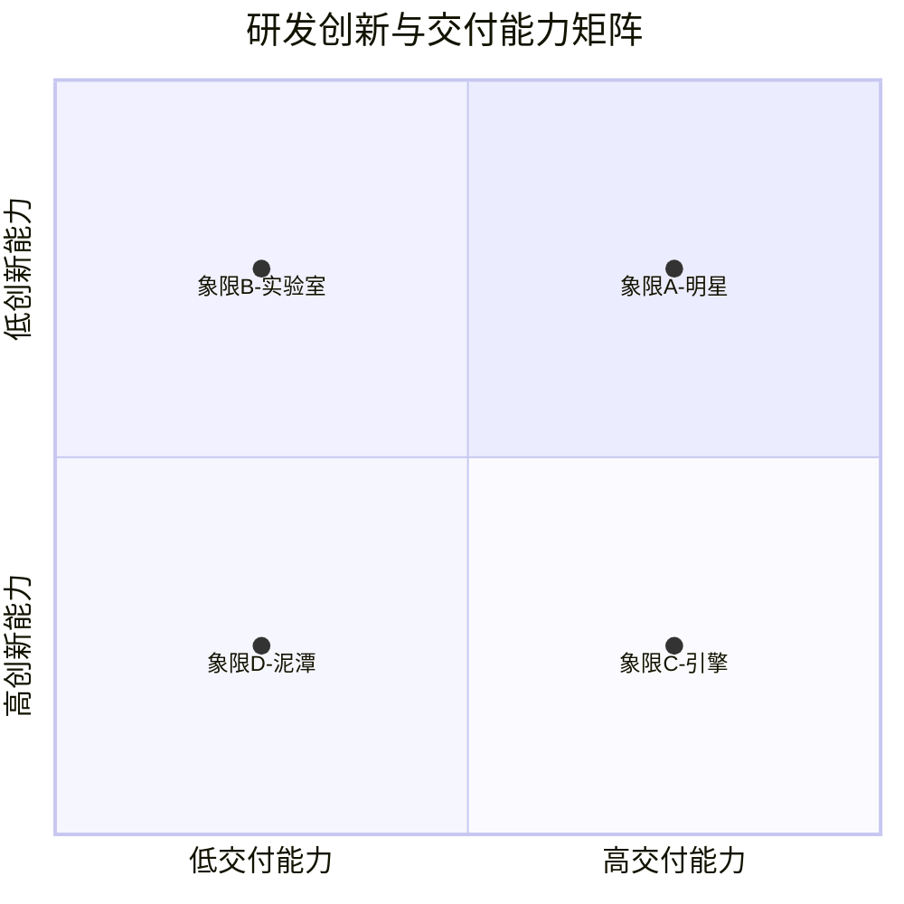

在讨论如何平衡之前，我们需要先回答一个更基本的问题：**创新和交付，到底是什么？**

这听起来像是一个语义学的问题，但定义不清会导致管理上的灾难。如果你把"创新"定义为"任何非日常交付的工作"，那你会把大量无意义的实验也算作创新。如果你把"交付"定义为"所有能产生收入的工作"，那你会忽略那些短期内不产生收入但长期至关重要的基础设施投资。

让我们从本质出发。

---

## 交付：确定性的价值兑现

**交付的核心特征是可预测性。**

当一个团队交付一个功能时，他们承诺的是：在某个时间点，某个用户能够使用某个能力。这个承诺的价值在于它的确定性——客户可以基于这个承诺来规划自己的行为。

交付体系擅长三件事：

1. **度量** — 交付速度、缺陷率、吞吐量，所有指标都是客观的、可量化的。
2. **预测** — 基于历史数据，你可以相当准确地预估下一个迭代能完成多少工作量。
3. **复用** — 流程、模板、自动化，交付体系的终极目标是把不确定的变成确定的。

交付的风险在于**过度优化确定性**。当一个团队的所有指标都是关于交付效率时，他们会逐渐失去尝试新事物的意愿——因为新事物意味着不确定性，而不确定性会伤害指标。

---

## 创新：不确定性的价值探索

**创新的核心特征是探索性。**

创新的本质不是"做新的事情"，而是"在不确定中寻找被验证的价值"。一个真正的创新过程包含三个环节：

1. **假设** — 我们相信某个未被验证的想法能产生价值。
2. **实验** — 我们用最低成本的方式验证这个假设。
3. **学习** — 无论实验结果如何，我们获得了之前不知道的信息。

创新体系擅长的事与交付恰恰相反：它擅长管理不确定性、从失败中提取信息、在混沌中发现模式。

创新的风险在于**把探索变成漫无目的的试错**。没有方向的创新是消耗，不是投资。

---

## 四象限模型：交付与创新的组合关系

把"交付能力"和"创新能力"作为两个独立维度，可以得到一个四象限模型：

**象限A（高交付 × 高创新）：明星团队**

这是所有组织追求的理想状态。团队既能高质量交付，又能持续创新。达到这个象限的团队通常有清晰的愿景、强大的技术能力和健康的团队文化。

典型案例：Amazon的AWS团队——他们既保持了业界领先的交付速度（每天数千次部署），又持续推出革命性的新服务（Lambda、SageMaker等）。

**象限B（低交付 × 高创新）：实验室**

团队有极强的创新能力，能产生大量好想法，但落地能力薄弱。常见于研究机构、初创公司的早期技术团队、或者"黑客文化"浓厚但缺乏工程规范的团队。

这个象限的危险在于：创新成果无法转化为实际价值。再好的想法，如果不能被交付给用户，最终只是PPT上的一个幻灯片。

**象限C（高交付 × 低创新）：引擎**

团队执行能力极强，但缺乏突破性的创新。他们把已知的事情做得越来越好，但很少质疑"我们是否在做正确的事情"。

这个象限的危险在于：短期表现优秀，长期可能被颠覆。许多传统IT部门就处于这个象限——交付稳定、流程完善，但在技术变革面前反应迟缓。

**象限D（低交付 × 低创新）：泥潭**

团队既不能有效交付，也没有创新能力。通常出现在组织混乱、士气低落、或者管理体系严重失灵的团队中。

---

## 关键洞察：这不是性格测试，这是管理杠杆

四象限模型的目的不是给团队贴标签，而是帮助领导者识别**管理杠杆点**：

- 如果你的团队在象限B（实验室），你需要加强的是工程能力建设、流程规范化和交付纪律。
- 如果你的团队在象限C（引擎），你需要创造的是探索空间、创新激励和"允许失败"的文化。
- 如果你的团队在象限D（泥潭），你需要的是全面的组织诊断——问题可能不在团队本身，而在更高层面的战略和管理体系。
- 如果你的团队在象限A（明星），你需要做的是维持这种平衡，防止任何一个维度的退化。

更重要的是：**团队在不同阶段可能处于不同象限，这是正常的。** 关键不是永远待在象限A，而是在需要的时候知道如何从当前象限移动到目标象限。

---

## 为什么我们会把它们对立起来？

追根溯源，创新和交付之所以被视为对立面，有三个原因：

**第一，资源竞争是真实的。** 一个工程师在同一时间只能做一件事。当她花两天时间实验一个新的技术方案时，这两天的确没有用于交付客户价值。这是经济学意义上的机会成本，不是什么管理幻觉。

**第二，认知负荷的冲突。** 交付需要专注，创新需要发散。一个人很难在同一时刻既保持交付节奏又保持创新状态。这解释了为什么即使有时间，很多工程师也不愿意做创新——因为他们需要从"交付模式"切换到"探索模式"。

**第三，最隐蔽的原因——评价体系的不兼容。** 交付用"完成度"来评价，创新用"学习价值"来评价。当你用同一套标准去衡量两者时，总会有一方被低估。这就是为什么许多公司的"创新考核"最终变成了形式主义的数字游戏。

这三个原因叠加在一起，创造了一个系统性的偏见：**管理者倾向于选择可衡量的（交付），而非重要的（创新）。**

下一章的动态平衡模型，就是要破解这个偏见。
